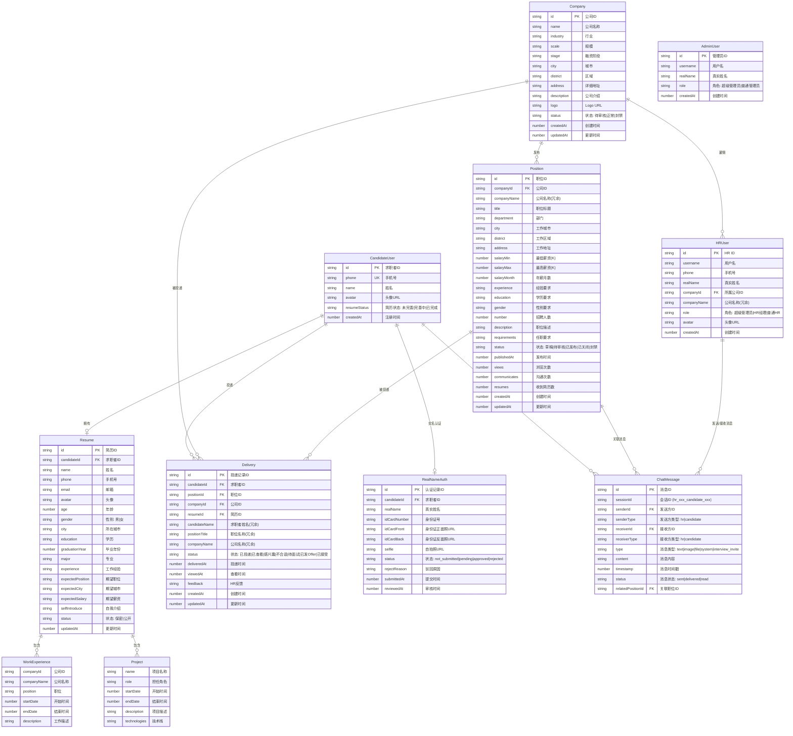
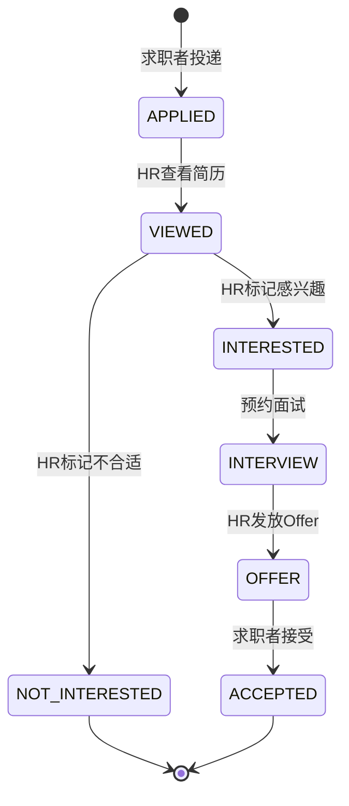

# BOSS 直聘 — 实体关系图 (ER Diagram)

> **格式**: Mermaid (纯文本、可编辑、Markdown 原生渲染)  
> **版本**: V1.0 | **日期**: 2026-05-26  
> **适用项目**: boss-candidate-ui / boss-company-ui / boss-manage-ui

---

## 一、全局 ER 图

---

## 二、关系说明

| 关系 | 类型 | 说明 |
|------|------|------|
| CandidateUser → Resume | **1:1** | 每个求职者拥有一份简历 |
| CandidateUser → Delivery | **1:N** | 一个求职者可投递多个职位 |
| CandidateUser → RealNameAuth | **1:1** | 每个求职者有一条实名认证记录 |
| Resume → WorkExperience | **1:N** | 简历包含多条工作经历（组合） |
| Resume → Project | **1:N** | 简历包含多条项目经历（组合） |
| Company → Position | **1:N** | 一个公司可发布多个职位 |
| Company → HRUser | **1:N** | 一个公司有多个 HR 账号 |
| Company → Delivery | **1:N** | 公司被多次投递 |
| Position → Delivery | **1:N** | 一个职位被多次投递 |
| Position → ChatMessage | **1:N** (可选) | 聊天消息可关联职位上下文 |
| CandidateUser → ChatMessage | **1:N** | 求职者参与多条聊天消息 |
| HRUser → ChatMessage | **1:N** | HR 参与多条聊天消息 |

> **注意**: ChatMessage 的 `senderId`/`receiverId` 是多态外键——根据 `senderType`/`receiverType` 分别指向 `CandidateUser` 或 `HRUser`。

---

## 三、枚举值速查

### 3.1 DeliveryStatus（投递状态流转）

### 3.2 其他枚举

| 枚举 | 值 |
|------|-----|
| **CompanyStatus** | `待审核` → `正常` / `封禁` |
| **PositionStatus** | `草稿` → `待审核` → `已发布` → `已关闭` / `封禁` |
| **MessageType** | `text` / `image` / `file` / `system` / `interview_invite` |
| **MessageStatus** | `sent` → `delivered` → `read` |
| **UserType** | `admin` / `hr` / `candidate` |
| **RealNameAuthStatus** | `not_submitted` → `pending` → `approved` / `rejected` |

---

## 四、关键字段设计约定

| 约定 | 说明 |
|------|------|
| 主键 ID | 全部使用 `string` 类型（如 `candidate_001`, `company_001`） |
| 时间戳 | Unix 毫秒时间戳 (`number`)，如 `1711900800000` |
| 薪资 | 拆分为 `salaryMin`(K) + `salaryMax`(K) + `salaryMonth`(月数)，展示时通过 `formatSalary()` 拼接为 `"25-35K·14薪"` |
| 会话 ID | `generateSessionId(hrId, candidateId)` → `"hr_{hrId}_candidate_{candidateId}"` |
| 冗余字段 | Delivery、Position、HRUser 中保留冗余的 `companyName`、`candidateName`、`positionTitle` 等字段以减少 JOIN 查询 |

---

> **使用说明**: 本 Mermaid ER 图可在 GitHub、Notion、飞书文档、VS Code（安装 Mermaid 插件）等支持 Mermaid 渲染的工具中直接查看和编辑。纯文本格式，可直接复制修改。
