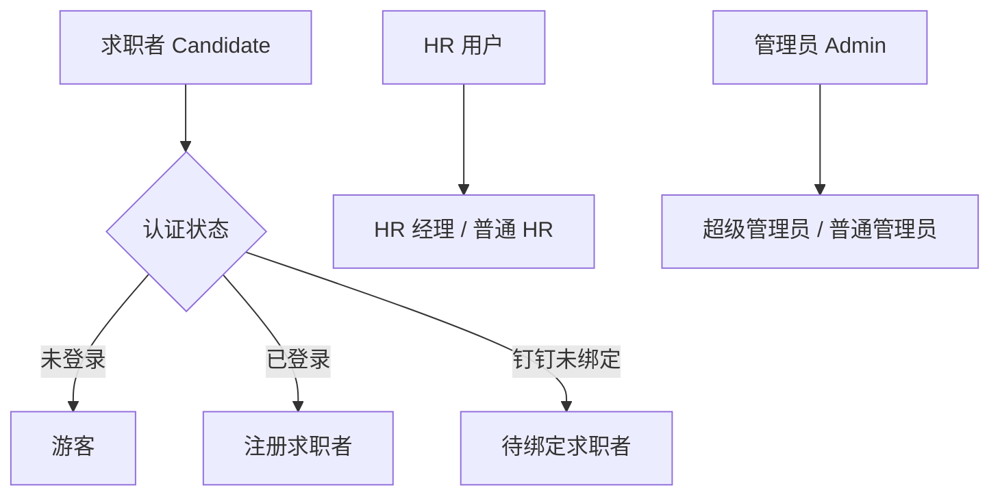
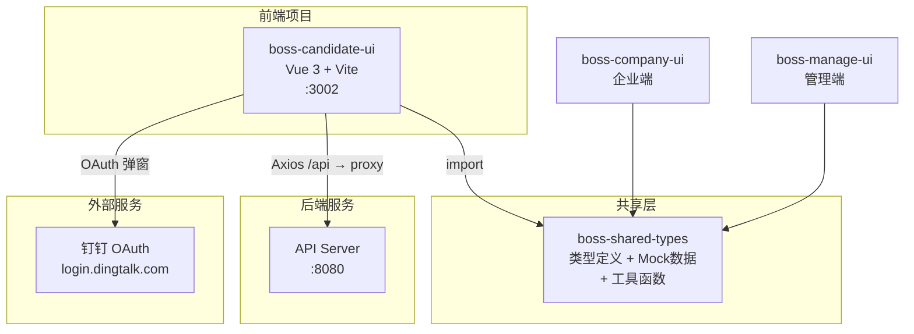
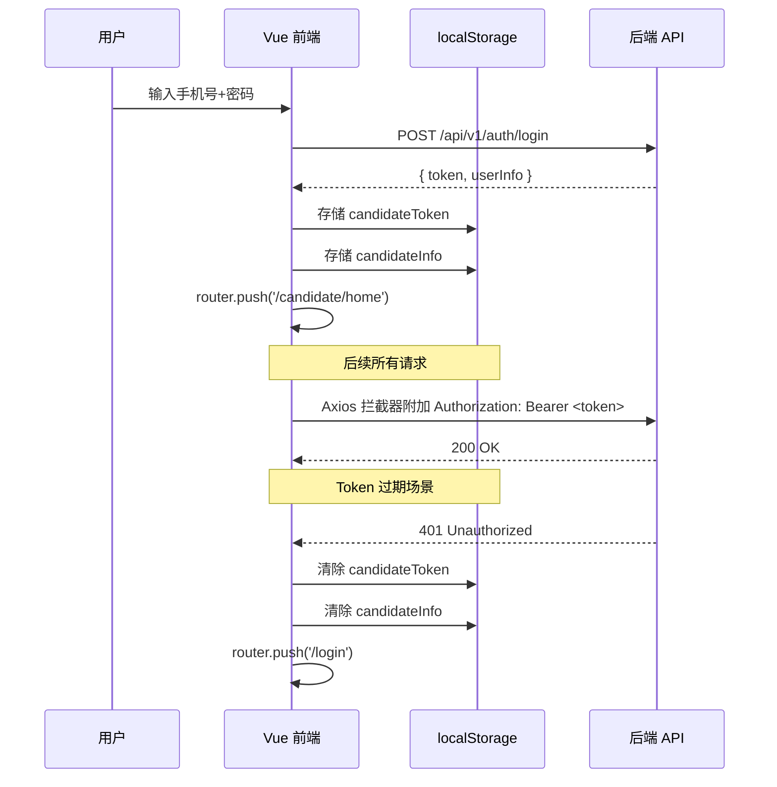

# BOSS 直聘求职者端 — 需求分析说明书

> **版本**: V1.0  
> **日期**: 2026-05-26  
> **技术栈**: Vue 3 + Element Plus + Vue Router + Axios + TypeScript  
> **涉及项目**: boss-candidate-ui、boss-shared-types

---

## 目录

1. [项目概述](#一项目概述)
2. [用户角色分析](#二用户角色分析)
3. [功能需求](#三功能需求)
   - [3.1 用户认证模块](#31-用户认证模块)
   - [3.2 首页 / 职位发现](#32-首页--职位发现)
   - [3.3 职位浏览与搜索](#33-职位浏览与搜索)
   - [3.4 即时通讯](#34-即时通讯)
   - [3.5 简历管理](#35-简历管理)
   - [3.6 投递记录](#36-投递记录)
   - [3.7 个人中心](#37-个人中心)
   - [3.8 实名认证](#38-实名认证)
   - [3.9 收藏（预留）](#39-收藏预留)
4. [非功能需求](#四非功能需求)
5. [系统架构](#五系统架构)
6. [接口概要](#六接口概要)
7. [附录：共享类型定义](#七附录共享类型定义)

---

## 一、项目概述

### 1.1 项目背景

本项目是 BOSS 直聘风格在线招聘平台的**求职者端（Candidate UI）**前端应用，面向求职者提供从注册登录、职位浏览搜索、简历管理、投递追踪到与 HR 即时沟通的一站式求职服务。

### 1.2 项目目标

- 为求职者提供流畅、直观的移动端优先的职位搜索与投递体验
- 支持多种登录方式（密码登录、短信验证码登录、钉钉第三方授权登录）
- 实现求职者与 HR 之间的实时沟通渠道
- 提供完整的简历管理和投递状态追踪能力
- 建立可复用的三端共享类型体系（与 boss-company-ui、boss-manage-ui 共享）

### 1.3 面向用户群体

| 用户群体 | 说明 |
|---------|------|
| 求职者（游客） | 未登录用户，仅可使用登录/注册功能 |
| 求职者（已注册） | 登录后可使用全部求职功能 |
| 求职者（待绑定） | 通过钉钉登录但未绑定手机号的用户 |

### 1.4 技术栈

| 层级 | 技术选型 | 版本 |
|------|---------|------|
| 前端框架 | Vue 3 (Composition API / `<script setup>`) | 3.5.30 |
| 构建工具 | Vite | 8.0.1 |
| UI 组件库 | Element Plus | 2.10.2 |
| 路由管理 | Vue Router | 4.6.3 |
| HTTP 客户端 | Axios | 1.10.0 |
| 图标库 | @element-plus/icons-vue | — |
| 共享类型 | boss-shared-types (本地包) | 1.0.0 |
| 开发端口 | localhost:3002 | — |
| API 代理 | → http://localhost:8080 | — |

---

## 二、用户角色分析

### 2.1 角色定义



### 2.2 角色详细描述

| 角色 | 标识 | 职责 | 关键属性 |
|------|------|------|---------|
| **游客** | 未登录 | 浏览登录/注册页 | 无持久化标识 |
| **注册求职者** | `UserType.CANDIDATE` | 搜索职位、投递简历、与HR沟通、管理简历 | id, phone, name, resumeStatus, avatar |
| **待绑定求职者** | 钉钉登录未绑定 | 需完成手机号绑定后才能使用全部功能 | 有钉钉授权但无 phone |
| **HR 用户** | `UserType.HR` | 发布职位、查看简历、与求职者沟通 | id, realName, companyId, role |
| **管理员** | `UserType.ADMIN` | 平台审核与管理 | id, username, role |

### 2.3 权限矩阵

| 功能模块 | 游客 | 已登录求职者 | 待绑定 | HR | 管理员 |
|---------|:---:|:---------:|:-----:|:--:|:----:|
| 登录 | ✅ | — | — | — | — |
| 注册 | ✅ | — | — | — | — |
| 钉钉登录 | ✅ | — | — | — | — |
| 手机绑定 | — | ✅ | ✅ | — | — |
| 首页浏览 | — | ✅ | — | — | — |
| 职位搜索 | — | ✅ | — | — | — |
| 职位详情 | — | ✅ | — | — | — |
| 投递简历 | — | ✅ | — | — | — |
| 聊天 | — | ✅ | — | — | — |
| 简历管理 | — | ✅ | — | — | — |
| 投递记录 | — | ✅ | — | — | — |
| 个人中心 | — | ✅ | — | — | — |
| 实名认证 | — | ✅ | — | — | — |

---

## 三、功能需求

### 3.1 用户认证模块

#### 3.1.1 密码登录 (Password Login)

| 属性 | 描述 |
|------|------|
| **功能编号** | UC-AUTH-001 |
| **功能名称** | 手机号 + 密码登录 |
| **参与者** | 游客 |
| **前置条件** | 用户已注册账号；当前未登录 |
| **后置条件（成功）** | 用户获得 JWT Token，存入 localStorage，跳转至首页 `/candidate/home` |
| **后置条件（失败）** | 停留在登录页，显示错误提示（密码错误 / 账号不存在） |
| **触发条件** | 用户在登录页输入手机号和密码，点击"登录"按钮或按 Enter 键 |

**基本流程：**

1. 用户进入登录页（`/login`）
2. 用户选择「密码登录」Tab（默认选中）
3. 用户输入手机号（11 位数字）
4. 用户输入密码
5. 用户勾选「记住我」（可选）
6. 用户点击"登录"按钮或按 Enter 键
7. 系统校验手机号格式（11 位数字）
8. 系统校验密码非空
9. **【当前 Mock】** 系统生成模拟 Token：`mock_token_${phone}_${Date.now()}`，存入 `localStorage.candidateToken`
10. 系统存储用户信息至 `localStorage.candidateInfo`
11. 路由守卫检测到 Token，放行至 `/candidate/home`

**异常流程：**

| 异常 | 处理方式 |
|------|---------|
| 手机号格式不合法 | 显示"请输入正确的手机号" |
| 密码为空 | 显示"请输入密码" |
| 账号不存在 | 显示"账号不存在，请先注册" |
| 密码错误 | 显示"密码错误" |
| 网络超时 | 显示"网络连接失败，请稍后重试" |

---

#### 3.1.2 短信验证码登录 (SMS Code Login)

| 属性 | 描述 |
|------|------|
| **功能编号** | UC-AUTH-002 |
| **功能名称** | 手机号 + 验证码登录 |
| **参与者** | 游客 |
| **前置条件** | 用户手机号已注册；当前未登录 |
| **后置条件（成功）** | 同密码登录 |
| **后置条件（失败）** | 停留在登录页，显示错误提示 |

**基本流程：**

1. 用户进入登录页
2. 用户切换到「验证码登录」Tab
3. 用户输入手机号
4. 用户点击"获取验证码"按钮
5. 系统发送短信验证码至该手机号
6. 按钮进入 60 秒倒计时，期间不可重复点击
7. 用户输入收到的 6 位验证码
8. 用户点击"登录"按钮
9. 系统校验验证码正确性
10. 登录成功，跳转至首页

**异常流程：**

| 异常 | 处理方式 |
|------|---------|
| 手机号未注册 | 提示"该手机号未注册，请先注册" |
| 验证码错误 | 提示"验证码错误，请重新输入" |
| 验证码过期 | 提示"验证码已过期，请重新获取" |
| 发送频率过高 | 60 秒内按钮置灰禁用 |
| 获取验证码失败 | 提示"验证码发送失败，请稍后重试" |

---

#### 3.1.3 钉钉 OAuth 第三方登录 (DingTalk Login)

| 属性 | 描述 |
|------|------|
| **功能编号** | UC-AUTH-003 |
| **功能名称** | 钉钉 OAuth 2.0 授权登录 |
| **参与者** | 游客 |
| **前置条件** | 用户拥有钉钉账号 |
| **后置条件（成功-已绑定）** | 获取 Token，跳转首页 |
| **后置条件（成功-未绑定）** | 跳转至手机绑定页面 `/bind-phone` |
| **后置条件（失败）** | 停留在登录页 / 弹窗关闭 |

**基本流程：**

1. 用户点击登录页"钉钉登录"按钮
2. 系统通过 `window.open` 打开钉钉 OAuth 授权页面：
   - URL: `https://login.dingtalk.com/oauth2/auth`
   - 参数: `client_id=dingmbiza7wx7lrsl05z`, `redirect_uri=http://127.0.0.1:8000/third_party/dingtalk/login/callback`, `response_type=code`, `scope=openid`, `state=STATE`, `prompt=consent`
3. 用户在钉钉授权页面完成授权
4. 钉钉回调页面通过 `window.opener.postMessage` 回传授权结果给父窗口
5. 父窗口监听 `message` 事件，接收回传数据

**分支 A — 用户已绑定手机号：**

6. 系统存储 Token 和用户信息至 localStorage
7. 关闭钉钉弹窗，跳转至首页

**分支 B — 用户未绑定手机号：**

6. 系统标记待绑定状态
7. 关闭钉钉弹窗，跳转至 `/bind-phone` 页面

**异常流程：**

| 异常 | 处理方式 |
|------|---------|
| 弹窗被浏览器拦截 | 提示"请允许弹窗以完成钉钉登录" |
| 用户取消授权 | 弹窗关闭，无提示，停留登录页 |
| 钉钉服务不可用 | 提示"钉钉授权服务暂不可用，请选择其他登录方式" |
| postMessage 跨域失败 | 提示"授权回调失败，请重试" |

---

#### 3.1.4 手机号绑定 (Bind Phone)

| 属性 | 描述 |
|------|------|
| **功能编号** | UC-AUTH-004 |
| **功能名称** | 钉钉登录后绑定手机号 |
| **参与者** | 待绑定求职者 |
| **前置条件** | 用户已完成钉钉授权；尚未绑定手机号；当前在 `/bind-phone` 页面 |
| **后置条件（成功）** | 手机号与钉钉账号绑定，更新 `candidateInfo.isPhoneBound = true`，跳转首页 |
| **后置条件（失败）** | 停留在绑定页，显示错误提示 |

**基本流程：**

1. 系统显示绑定手机号页面
2. 用户输入手机号
3. 用户点击"获取验证码"
4. 用户输入短信验证码
5. 用户点击"确认绑定"
6. 系统校验验证码
7. 系统完成手机号与钉钉账号的绑定
8. 更新 `localStorage.candidateInfo` 中的 phone 和 `isPhoneBound: true`
9. 跳转至首页

**异常流程：**

| 异常 | 处理方式 |
|------|---------|
| 手机号已被其他账号绑定 | 提示"该手机号已被绑定，请更换" |
| 验证码错误 | 提示"验证码错误" |
| 手机号格式不正确 | 提示"请输入正确的手机号" |

---

#### 3.1.5 用户注册 (Register)

| 属性 | 描述 |
|------|------|
| **功能编号** | UC-AUTH-005 |
| **功能名称** | 用户注册（三步流程） |
| **参与者** | 游客 |
| **前置条件** | 用户未注册；当前在 `/register` 页面 |
| **后置条件（成功）** | 账号创建成功，跳转至登录页 |
| **后置条件（失败）** | 停留在当前步骤 |

**基本流程：**

**步骤一 — 手机验证：**

1. 用户输入手机号
2. 用户点击"获取验证码"（60 秒倒计时）
3. 用户输入收到的验证码
4. 用户勾选"同意《用户协议》和《隐私政策》"
5. 用户点击"下一步"
6. 系统验证：手机号格式（11 位）、验证码非空、已同意条款
7. 进入步骤二

**步骤二 — 设置密码：**

8. 用户输入密码（6-16 位）
9. 用户输入确认密码
10. 用户点击"完成注册"
11. 系统验证：两次密码一致、密码长度 6-16 位
12. 注册成功，进入步骤三

**步骤三 — 注册成功：**

13. 显示成功图标和提示文字
14. 用户点击"立即登录"按钮
15. 跳转至登录页 `/login`

**异常流程：**

| 异常 | 处理方式 |
|------|---------|
| 手机号已注册 | 提示"该手机号已注册" |
| 未勾选同意条款 | 提示"请先同意用户协议和隐私政策" |
| 两次密码不一致 | 提示"两次输入的密码不一致" |
| 密码长度不合法 | 提示"密码长度需要 6-16 位" |
| 注册接口失败 | 提示"注册失败，请稍后重试" |

---

#### 3.1.6 退出登录 (Logout)

| 属性 | 描述 |
|------|------|
| **功能编号** | UC-AUTH-006 |
| **功能名称** | 退出登录 |
| **参与者** | 已登录求职者 |
| **前置条件** | 用户处于已登录状态 |
| **后置条件** | 清除 localStorage 中所有认证信息；跳转至 `/login` |
| **触发条件** | 用户在个人中心页面点击"退出登录"，或响应拦截器检测到 401 状态码 |

**基本流程：**

1. 用户点击"退出登录"按钮
2. 系统弹出确认对话框："确定要退出登录吗？"
3. 用户确认
4. 系统清除 `localStorage.candidateToken`
5. 系统清除 `localStorage.candidateInfo`
6. 系统跳转至 `/login` 页面

**异常流程：**

| 异常 | 处理方式 |
|------|---------|
| Token 过期自动登出 | 响应拦截器检测到 401 → 静默清除 Token → 跳转登录页 |

---

### 3.2 首页 / 职位发现

#### 3.2.1 首页概览 (Home Dashboard)

| 属性 | 描述 |
|------|------|
| **功能编号** | UC-HOME-001 |
| **功能名称** | 首页仪表盘 |
| **参与者** | 已登录求职者 |
| **前置条件** | 用户已登录；在 `/candidate/home` |
| **后置条件** | 无状态变更（纯展示页面） |
| **触发条件** | 用户登录后自动跳转，或点击底部导航"首页"Tab |

**页面组成：**

1. **求职期望卡片** — 展示用户期望职位、城市、薪资范围；可点击"编辑"（当前为预留功能）
2. **搜索栏** — 搜索职位/公司关键词
3. **搜索历史** — 展示最近搜索关键词标签，可点击快速搜索，可一键清空
4. **行业分类** — 6 大行业分类卡片（互联网、金融、教育、医疗、制造业、传媒），每项显示职位数量
5. **推荐职位** — 展示 4 个推荐职位，点击查看详情
6. **热门城市** — 10 个热门城市标签（北京、上海、广州、深圳等），点击按城市筛选职位

---

#### 3.2.2 关键词搜索 (Keyword Search)

| 属性 | 描述 |
|------|------|
| **功能编号** | UC-HOME-002 |
| **功能名称** | 首页关键词搜索 |
| **参与者** | 已登录求职者 |
| **前置条件** | 用户在首页 |
| **后置条件** | 跳转至职位列表页 `/candidate/jobs?keyword=<关键词>` |
| **触发条件** | 用户在搜索栏输入关键词后按 Enter 或点击搜索图标；或点击搜索历史标签 |

**基本流程：**

1. 用户在首页搜索栏输入关键词
2. 用户按 Enter 键或点击搜索图标
3. 系统将关键词同步至路由参数 `?keyword=xxx`
4. 系统跳转至职位列表页（底部导航同步切换到"职位"Tab）

**备选流程 — 搜索历史点击：**

1. 用户直接点击搜索历史标签
2. 行为同上述步骤 3-4

**备选流程 — 清除历史：**

1. 用户点击"清除历史"
2. 系统弹出确认框
3. 用户确认后清空搜索历史数组

---

#### 3.2.3 行业分类浏览 (Category Browse)

| 属性 | 描述 |
|------|------|
| **功能编号** | UC-HOME-003 |
| **功能名称** | 按行业分类浏览职位 |
| **参与者** | 已登录求职者 |
| **前置条件** | 用户在首页 |
| **后置条件** | 跳转至职位列表页 `/candidate/jobs?category=<分类>` |

**基本流程：**

1. 用户点击某个行业分类卡片（互联网/金融/教育/医疗/制造业/传媒）
2. 系统将分类参数添加至路由
3. 跳转至职位列表页

---

#### 3.2.4 热门城市筛选 (Hot City Filter)

| 属性 | 描述 |
|------|------|
| **功能编号** | UC-HOME-004 |
| **功能名称** | 热门城市快速筛选 |
| **参与者** | 已登录求职者 |
| **前置条件** | 用户在首页 |
| **后置条件** | 跳转至职位列表页 `/candidate/jobs?city=<城市名>` |

**基本流程：**

1. 用户点击某个热门城市标签
2. 系统将城市参数添加至路由
3. 跳转至职位列表页（自动按该城市筛选职位）

---

### 3.3 职位浏览与搜索

#### 3.3.1 职位列表 (Job List)

| 属性 | 描述 |
|------|------|
| **功能编号** | UC-JOB-001 |
| **功能名称** | 职位列表浏览与筛选 |
| **参与者** | 已登录求职者 |
| **前置条件** | 用户已登录；在 `/candidate/jobs` |
| **后置条件** | 无状态变更 |
| **触发条件** | 点击底部导航"职位"Tab；或从首页跳转带参数进入 |

**基本流程：**

1. 用户进入职位列表页
2. 系统从路由 query 参数（`keyword`, `city`, `category`）初始化筛选条件
3. 系统展示职位卡片列表，每张卡片显示：
   - 职位标题（含"热"标签 if status=`已发布`）
   - 公司名称
   - 薪资范围（如 `25-35K·14薪`）
   - 工作城市
   - 经验要求 / 学历要求
   - 福利标签
4. 用户可输入关键词进行文本搜索
5. 用户可通过下拉选择城市进行筛选
6. 用户点击"搜索"按钮触发筛选
7. 用户点击职位卡片跳转至职位详情页 `/candidate/jobs/:id`

**异常流程：**

| 异常 | 处理方式 |
|------|---------|
| 搜索无结果 | 显示"暂无匹配的职位"空状态 |
| 数据加载失败 | 显示加载失败提示 |

---

#### 3.3.2 职位详情 (Job Detail)

| 属性 | 描述 |
|------|------|
| **功能编号** | UC-JOB-002 |
| **功能名称** | 职位详情查看 |
| **参与者** | 已登录求职者 |
| **前置条件** | 用户点击某职位进入；路由参数 `:id` 有效 |
| **后置条件** | 可能产生投递或聊天操作 |
| **触发条件** | 在职位列表或首页推荐点击某职位 |

**页面组成：**

1. **顶部导航** — 返回按钮、分享按钮（预留）
2. **职位核心信息** — 标题、薪资范围、收藏按钮（预留）
3. **标签行** — 城市、经验要求、学历要求
4. **发布时间** — 相对时间（如"3 天前"）
5. **职位描述** — 多段文本
6. **福利标签** — 五险一金、年终奖、股票期权等
7. **公司信息** — 公司名、行业、规模、融资阶段、公司介绍
8. **工作地址** — 详细地址
9. **底部固定操作栏** — "立即沟通"和"申请职位"两个按钮

**交互操作：**

| 操作 | 行为 |
|------|------|
| 点击"返回" | 浏览器后退 |
| 点击"分享" | 提示"分享功能开发中" |
| 点击"收藏" | 提示"已收藏"（预留） |
| 点击"立即沟通" | 弹出确认框 → 跳转至 `/candidate/chat?hrId=1` |
| 点击"申请职位" | 弹出确认框 → 提示"投递成功" |

**异常流程：**

| 异常 | 处理方式 |
|------|---------|
| 职位 ID 不存在 | 显示"职位不存在"空状态 |
| 投递时未登录 | 路由守卫拦截，跳转登录页 |

---

### 3.4 即时通讯

#### 3.4.1 会话列表 (Chat List)

| 属性 | 描述 |
|------|------|
| **功能编号** | UC-CHAT-001 |
| **功能名称** | 聊天会话列表 |
| **参与者** | 已登录求职者 |
| **前置条件** | 用户已登录；在 `/candidate/chat` |
| **后置条件** | 无状态变更 |

**页面组成：**

每个会话卡片显示：
- HR 头像（含在线状态绿点）
- HR 姓名
- 公司 / 职位
- 关联职位标题
- 最后一条消息预览
- 最后消息时间（相对时间）
- 未读消息数角标
- 电话 / 视频按钮（悬停显示，移动端隐藏）

**交互操作：**

| 操作 | 行为 |
|------|------|
| 点击会话卡片 | 进入聊天窗口 `/candidate/chat/:hrId` |
| 点击电话按钮 | 弹出确认框 → 提示拨打中 |
| 点击视频按钮 | 弹出确认框 → 提示"视频面试功能开发中" |

---

#### 3.4.2 聊天窗口 (Chat Window)

| 属性 | 描述 |
|------|------|
| **功能编号** | UC-CHAT-002 |
| **功能名称** | 与 HR 一对一聊天 |
| **参与者** | 已登录求职者 |
| **前置条件** | 用户已登录；存在有效的 hrId；在 `/candidate/chat/:hrId` |
| **后置条件** | 生成新消息记录 |

**页面组成：**

1. **顶部聊天头部** — 返回、HR 姓名 + 在线状态、公司/职位、电话/视频/更多按钮
2. **关联职位卡片** — 显示薪资和"查看职位"链接
3. **消息列表** — 三种气泡样式：
   - HR 消息：白色背景，左对齐，带头像
   - 求职者消息：蓝色（`#0084ff`）背景，右对齐，带头像
   - 系统消息：灰色背景，居中
4. **底部输入区** — 多行文本框（3 行）、发送按钮
5. **工具栏** — 图片/文件/表情按钮（预留）

**消息类型枚举：**

| 类型 | 枚举值 | 说明 |
|------|--------|------|
| 文本 | `TEXT` | 普通文本消息 |
| 图片 | `IMAGE` | 图片消息（预留） |
| 文件 | `FILE` | 文件消息（预留） |
| 系统 | `SYSTEM` | 系统通知消息（如"交换了电话"） |
| 面试邀请 | `INTERVIEW_INVITE` | 面试邀请消息（预留） |

**交互操作：**

| 操作 | 行为 |
|------|------|
| 输入文字 → 点击发送 / Enter | 消息发送，显示在右侧蓝色气泡中 |
| Shift + Enter | 文本换行 |
| 点击关联职位卡片 | 跳转至职位详情 |
| 点击电话 | 预留功能 |
| 点击视频 | 预留功能 |
| 点击图片/文件/表情 | 预留功能 |

**模拟自动回复：**

- 求职者发送消息后，约 2 秒后模拟 HR 回复一条文本消息
- 发送后自动滚动至底部

---

### 3.5 简历管理

#### 3.5.1 简历查看与编辑 (Resume Management)

| 属性 | 描述 |
|------|------|
| **功能编号** | UC-RES-001 |
| **功能名称** | 简历查看与分段编辑 |
| **参与者** | 已登录求职者 |
| **前置条件** | 用户已登录；在 `/candidate/resume` |
| **后置条件** | 简历信息更新 |

**页面组成：**

1. **头像区域** — 带相机编辑角标（点击预留）
2. **完成度进度条** — 当前 65%，显示"简历完整度"
3. **基本信息** — 姓名、年龄、手机号、邮箱
4. **工作经历** — 公司、职位、时间
5. **教育经历** — 学历、学校、专业
6. **项目经历** — 项目名、职责、技术栈
7. **技能** — 技能标签列表
8. **求职期望** — 期望职位、城市、薪资

**简历分段状态管理：**

| 分段 | 当前状态 | 说明 |
|------|---------|------|
| 基本信息 | ✅ 已完成 | 可编辑 |
| 工作经历 | ⚠️ 未完善 | 红色标记，需完善 |
| 教育经历 | ✅ 已完成 | 可编辑 |
| 项目经历 | ⚠️ 未完善 | 红色标记，需完善 |
| 技能 | ✅ 已完成 | 可编辑 |

**交互操作：**

| 操作 | 行为 |
|------|------|
| 点击分段"编辑"按钮 | 弹出确认框 → 提示"编辑功能开发中" |
| 点击头像相机图标 | 提示"上传头像功能开发中" |
| 点击"上传简历文件" | 触发文件选择器（PDF/Word，max 10MB），显示文件名 |

---

### 3.6 投递记录

#### 3.6.1 投递状态追踪 (Delivery Tracking)

| 属性 | 描述 |
|------|------|
| **功能编号** | UC-DEL-001 |
| **功能名称** | 投递记录查看与状态追踪 |
| **参与者** | 已登录求职者 |
| **前置条件** | 用户已登录；在 `/candidate/delivery` |
| **后置条件** | 无状态变更（纯展示） |

**投递状态枚举：**

| 状态 | 枚举值 | 标签颜色 | 说明 |
|------|--------|---------|------|
| 已投递 | `APPLIED` | 灰色 info | 初始状态 |
| 已被查看 | `VIEWED` | 蓝色 primary | HR 已浏览 |
| 感兴趣 | `INTERESTED` | 绿色 success | HR 标记感兴趣 |
| 不合适 | `NOT_INTERESTED` | 红色 danger | HR 标记不合适 |
| 待面试 | `INTERVIEW` | 橙色 warning | 已预约面试 |
| 已发 Offer | `OFFER` | 绿色 success | HR 已发 Offer |
| 已接受 | `ACCEPTED` | 绿色 success | 求职者已接受 |

**每个投递记录卡片展示：**

- 职位名称
- 状态标签（颜色对应上表）
- 公司名称
- 行业 / 规模
- 工作城市
- 薪资范围
- 投递时间（格式化为相对时间）
- HR 反馈（如有）

**交互操作：**

| 操作 | 行为 |
|------|------|
| 点击"查看职位" | 跳转至职位详情 |
| 点击"立即沟通" | 跳转至聊天窗口（NOT_INTERESTED 状态下隐藏此按钮） |

---

### 3.7 个人中心

#### 3.7.1 个人中心 (Profile Center)

| 属性 | 描述 |
|------|------|
| **功能编号** | UC-PRO-001 |
| **功能名称** | 个人中心与设置 |
| **参与者** | 已登录求职者 |
| **前置条件** | 用户已登录；在 `/candidate/profile` |

**页面组成：**

**A. 用户信息区域：**
- 头像（相机编辑角标，预留）
- 姓名（张先生）
- 手机号（脱敏显示：138****8888）
- 简历状态（完善中）
- 求职期望（职位/城市/薪资）
- 简历完成度进度条（65%）

**B. 菜单分组：**

| 分组 | 菜单项 | 跳转 | 角标 | 开发状态 |
|------|--------|------|------|---------|
| 求职相关 | 我的简历 | `/candidate/resume` | — | ✅ 已实现 |
| | 投递记录 | `/candidate/delivery` | 3 | ✅ 已实现 |
| | 我的收藏 | `/candidate/favorites` | — | ⚠️ 框架搭建中 |
| | 面试邀请 | — | 1 | ❌ 开发中 |
| 沟通 | 谁看过我 | — | — | ❌ 开发中 |
| | 沟通过 | `/candidate/chat` | — | ✅ 已实现 |
| | 消息通知 | — | 5 | ❌ 开发中 |
| 账号安全 | 账号设置 | — | — | ❌ 开发中 |
| | 实名认证 | `/candidate/realname-auth` | — | ✅ 已实现 |
| | 隐私设置 | — | — | ❌ 开发中 |
| | 我的钱包 | — | 0.00 | ❌ 开发中 |
| 其他服务 | 优惠券 | — | 2 | ❌ 开发中 |
| | 在线竞争力 | — | — | ❌ 开发中 |
| | 帮助中心 | — | — | ❌ 开发中 |
| | 联系客服 | — | — | ❌ 开发中 |

**交互操作：**

| 操作 | 行为 |
|------|------|
| 点击已实现菜单 | 跳转对应页面 |
| 点击开发中菜单 | 弹窗提示"功能开发中，敬请期待" |
| 点击期望编辑 | 提示"编辑功能开发中" |
| 点击退出登录 | 确认弹窗 → 清除 Token → 跳转登录页 |

---

### 3.8 实名认证

#### 3.8.1 实名认证 (Real-Name Authentication)

| 属性 | 描述 |
|------|------|
| **功能编号** | UC-AUTH-007 |
| **功能名称** | 实名身份认证（KYC） |
| **参与者** | 已登录求职者 |
| **前置条件** | 用户已登录；在 `/candidate/realname-auth` |
| **后置条件（成功）** | 认证状态更新为 `pending` 审核中 |
| **后置条件（失败）** | 停留在当前页面，显示错误提示 |

**认证状态管理：**

| 状态 | 页面表现 |
|------|---------|
| `not_submitted`（未提交） | 显示提交流程（三步进度 + 表单） |
| `pending`（审核中） | 显示审核中提示（时钟图标） |
| `approved`（已通过） | 显示认证成功结果（姓名、身份证号部分脱敏、认证时间） |
| `rejected`（已驳回） | 显示驳回原因 + "重新认证"按钮 |

**提交表单字段：**

| 字段 | 校验规则 |
|------|---------|
| 真实姓名 | 2-10 个汉字 |
| 身份证号 | 18 位，正则校验格式 |
| 身份证正面照 | JPEG/PNG，≤ 10MB |
| 身份证反面照 | JPEG/PNG，≤ 10MB |
| 自拍照片 | 通过摄像头实时拍摄或上传 |

**自拍采集流程：**

1. 用户点击"拍摄自拍"
2. 系统弹出摄像头对话框
3. 系统调用 `navigator.mediaDevices.getUserMedia` 开启摄像头
4. 用户在预览画面中点击"拍照"按钮
5. 视频帧绘制到 Canvas，转为 Blob → File 对象
6. 显示拍照预览
7. 用户可点击"重拍"重新采集，或点击"确定"确认
8. 关闭摄像头对话框，照片回填至表单

**提交流程：**

1. 所有字段填写完成
2. 用户点击"提交认证"
3. 系统弹出确认对话框
4. 用户确认
5. 系统 POST `/api/v1/auth/realname/submit`（multipart/form-data）
6. 提交成功后状态变为 `pending`，刷新页面显示审核中

**API 接口（真实对接）：**

| 接口 | 方法 | 说明 |
|------|------|------|
| `/api/v1/auth/realname/status` | GET | 查询认证状态 |
| `/api/v1/auth/realname/submit` | POST | 提交认证材料（multipart） |

---

### 3.9 收藏（预留）

| 属性 | 描述 |
|------|------|
| **功能编号** | UC-FAV-001 |
| **功能名称** | 职位收藏 |
| **参与者** | 已登录求职者 |
| **当前状态** | **框架已搭建，功能待开发** |

当前 `/candidate/favorites` 仅渲染占位文本"收藏"。未来需实现：
- 收藏 / 取消收藏职位
- 收藏列表展示
- 从收藏快速投递或沟通

---

## 四、非功能需求

### 4.1 性能需求

| 指标 | 要求 |
|------|------|
| 首屏加载时间 | ≤ 3 秒 |
| 页面路由切换 | ≤ 500ms |
| API 请求超时 | 15 秒 |
| 静态资源 | Vite 构建，Tree Shaking + Code Splitting |

### 4.2 安全性需求

| 要求 | 实现方式 |
|------|---------|
| 身份认证 | JWT Bearer Token，存于 localStorage，每次请求通过 Axios 拦截器附加 |
| 路由保护 | Vue Router beforeEach 全局守卫，未登录自动跳转登录页 |
| 自动登出 | 401 响应 → 拦截器清除 Token → 静默跳转登录页（无红色错误提示） |
| 密码传输 | 建议后续接入 HTTPS + 密码加密 |
| XSS 防护 | Vue 默认模板转义；Element Plus 组件内置防护 |

### 4.3 可用性需求

| 要求 | 说明 |
|------|------|
| 响应式设计 | 桌面端 + 移动端适配，断点 768px / 968px |
| 底部导航 | 固定底栏，适配移动端操作习惯 |
| 错误处理 | 网络错误、超时、服务端错误均有中文提示 |
| 加载状态 | 按钮 loading 状态防重复提交 |
| 空状态 | 搜索无结果 / 列表无数据时展示空状态提示 |
| 60px 底部安全区 | 所有页面底部留白 60px，避免被固定底栏遮挡 |

### 4.4 兼容性需求

| 浏览器 | 最低版本 |
|--------|---------|
| Chrome | ≥ 90 |
| Edge | ≥ 90 |
| Safari | ≥ 14 |
| Firefox | ≥ 88 |
| 移动端浏览器 | iOS Safari ≥ 14 / Android Chrome ≥ 90 |

### 4.5 可维护性需求

| 要求 | 实现 |
|------|------|
| 类型共享 | boss-shared-types 包提供统一类型定义 |
| 代码规范 | Composition API + `<script setup>` 统一风格 |
| Mock 标记 | 所有未对接接口标记 `// TODO: 对接真实接口` |

---

## 五、系统架构

### 5.1 总体架构



### 5.2 前端目录结构

```
boss-candidate-ui/
├── index.html                  # 入口 HTML
├── vite.config.js              # Vite 配置（@ 别名 + API 代理）
├── package.json
├── public/
│   ├── favicon.svg
│   └── icons/dingtalk.svg      # 钉钉图标
├── src/
│   ├── main.js                 # 入口（注册 Vue、Router、ElementPlus）
│   ├── App.vue                 # 根组件（只含 <router-view />）
│   ├── style.css               # 全局样式重置
│   ├── router/index.js         # 路由表 + 导航守卫
│   ├── utils/request.js        # Axios 实例（拦截器）
│   ├── layouts/
│   │   └── CandidateLayout.vue # 应用外壳（底栏 + 顶栏 + 内容区）
│   └── pages/
│       ├── Login.vue           # 登录页（密码/短信/钉钉）
│       ├── Register.vue        # 注册页（三步流程）
│       ├── BindPhone.vue       # 手机绑定页
│       ├── Home.vue            # 首页仪表盘
│       ├── jobs/
│       │   ├── JobList.vue     # 职位列表
│       │   └── JobDetail.vue   # 职位详情
│       ├── chat/
│       │   ├── Chat.vue        # 会话列表
│       │   └── ChatWindow.vue  # 聊天窗口
│       ├── resume/
│       │   └── Resume.vue      # 简历管理
│       ├── delivery/
│       │   └── DeliveryRecord.vue  # 投递记录
│       ├── favorites/
│       │   └── Favorites.vue   # 收藏（预留）
│       └── profile/
│           ├── Profile.vue     # 个人中心
│           └── RealNameAuth.vue # 实名认证
```

### 5.3 路由设计

```mermaid
graph LR
    subgraph 公开路由
        A[/login] --> A1[Login.vue]
        B[/register] --> B1[Register.vue]
        C[/bind-phone] --> C1[BindPhone.vue]
    end
    
    subgraph 认证路由 _需要Token_
        D[/candidate/home] --> D1[Home.vue]
        E[/candidate/jobs] --> E1[JobList.vue]
        F[/candidate/jobs/:id] --> F1[JobDetail.vue]
        G[/candidate/chat] --> G1[Chat.vue]
        H[/candidate/chat/:hrId] --> H1[ChatWindow.vue]
        I[/candidate/resume] --> I1[Resume.vue]
        J[/candidate/delivery] --> J1[DeliveryRecord.vue]
        K[/candidate/favorites] --> K1[Favorites.vue]
        L[/candidate/profile] --> L1[Profile.vue]
        M[/candidate/realname-auth] --> M1[RealNameAuth.vue]
    end
    
    A -.->|已登录| D
    D --> Guard{全局守卫<br/>candidateToken?}
```

### 5.4 认证与数据流



---

## 六、接口概要

### 6.1 已对接接口

| 接口 | 方法 | 说明 | 状态 |
|------|------|------|------|
| `/api/v1/auth/realname/status` | GET | 查询实名认证状态 | ✅ 已对接 |
| `/api/v1/auth/realname/submit` | POST | 提交实名认证材料 | ✅ 已对接 |
| `https://login.dingtalk.com/oauth2/auth` | OAuth | 钉钉授权 | ✅ 已对接 |

### 6.2 待对接接口

以下接口当前使用 Mock 数据模拟，需后续对接真实后端：

| 接口 | 方法 | 调用页面 | 说明 |
|------|------|---------|------|
| `/api/v1/auth/login` | POST | Login.vue | 密码登录 |
| `/api/v1/auth/sms/send` | POST | Login.vue, Register.vue, BindPhone.vue | 发送短信验证码 |
| `/api/v1/auth/sms/login` | POST | Login.vue | 验证码登录 |
| `/api/v1/auth/register` | POST | Register.vue | 用户注册 |
| `/api/v1/auth/dingtalk/bind` | POST | BindPhone.vue | 钉钉账号绑定手机 |
| `/api/v1/positions` | GET | JobList.vue, Home.vue | 职位列表（含筛选） |
| `/api/v1/positions/:id` | GET | JobDetail.vue | 职位详情 |
| `/api/v1/delivery` | POST | JobDetail.vue | 投递简历 |
| `/api/v1/delivery` | GET | DeliveryRecord.vue | 投递记录列表 |
| `/api/v1/resume` | GET | Resume.vue | 获取简历 |
| `/api/v1/resume` | PUT | Resume.vue | 更新简历 |
| `/api/v1/resume/upload` | POST | Resume.vue | 上传简历文件 |
| `/api/v1/chat/sessions` | GET | Chat.vue | 会话列表 |
| `/api/v1/chat/messages/:sessionId` | GET | ChatWindow.vue | 聊天消息历史 |
| `/api/v1/chat/messages` | POST | ChatWindow.vue | 发送消息 |
| `/api/v1/favorites` | GET/POST/DELETE | Favorites.vue | 收藏管理 |

### 6.3 请求规范

| 规范项 | 说明 |
|--------|------|
| 认证方式 | `Authorization: Bearer <token>` |
| 基础路径 | `/api`（Vite 代理至 `http://localhost:8080`） |
| 超时时间 | 15000ms (15 秒) |
| 响应格式 | JSON，包含 `code`、`message`、`data` 字段 |
| 成功码 | `code === 200` |
| 401 处理 | 清除 Token，跳转登录页 |

---

## 七、附录：共享类型定义

### 7.1 枚举类型一览

| 枚举 | 值 | 说明 |
|------|-----|------|
| `UserType` | `ADMIN` / `HR` / `CANDIDATE` | 用户角色 |
| `CompanyStatus` | `待审核` / `正常` / `封禁` | 公司状态 |
| `PositionStatus` | `草稿` / `待审核` / `已发布` / `已关闭` / `封禁` | 职位状态 |
| `DeliveryStatus` | `已投递` / `已查看` / `感兴趣` / `不合适` / `待面试` / `已发 Offer` / `已接受` | 投递状态 |
| `MessageType` | `text` / `image` / `file` / `system` / `interview_invite` | 消息类型 |
| `MessageStatus` | `sent` / `delivered` / `read` | 消息状态 |

### 7.2 核心接口一览

| 接口 | 字段数 | 说明 |
|------|--------|------|
| `Company` | 13 | 公司信息 |
| `Position` | 27 | 职位信息 |
| `HRUser` | 9 | HR 用户 |
| `CandidateUser` | 6 | 求职者用户 |
| `AdminUser` | 5 | 管理员用户 |
| `ChatMessage` | 11 | 聊天消息 |
| `Resume` | 22 | 简历 |
| `WorkExperience` | 6 | 工作经历 |
| `Project` | 6 | 项目经历 |
| `Delivery` | 14 | 投递记录 |

### 7.3 设计约定

| 约定 | 说明 |
|------|------|
| ID 类型 | 全部使用 `string` |
| 时间格式 | Unix 毫秒时间戳 (`number`) |
| 薪资存储 | 三个独立字段：`salaryMin`(K), `salaryMax`(K), `salaryMonth`(月数) |
| 语言约定 | 注释和枚举值使用中文 |

---

> **文档维护说明**: 本文档基于 boss-candidate-ui 前端代码与 boss-shared-types 类型定义编写，反映的是截至 2026-05-26 的项目状态。随着功能迭代和接口对接，需同步更新本文档。
