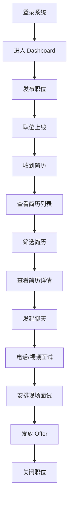

# BOSS 直聘企业端 - 页面功能介绍

## 📱 系统概览

BOSS 直聘企业端招聘管理系统是一套面向企业 HR 的一站式招聘解决方案，涵盖职位管理、简历筛选、在线沟通、数据分析等核心功能。

---

## 🗂️ 功能模块总览

| 序号 | 页面名称 | 路由路径 | 核心功能 | 完成度 |
|------|----------|----------|----------|--------|
| 1 | 登录页 | `/login` | 账号密码登录、记住登录状态 | ✅ 100% |
| 2 | 招聘管理首页 | `/company/dashboard` | 今日概览、职位效果、待办事项 | ✅ 95% |
| 3 | 职位列表 | `/company/positions` | 职位管理、筛选、操作 | ✅ 90% |
| 4 | 职位详情 | `/company/positions/:id` | 职位详细信息 | ⏳ 开发中 |
| 5 | 发布职位 | `/company/positions/publish` | 创建新职位 | ⏳ 开发中 |
| 6 | 简历列表 | `/company/resumes` | 简历筛选、智能匹配 | ✅ 90% |
| 7 | 简历详情 | `/company/resumes/:id` | 完整简历展示、快捷操作 | ✅ 85% |
| 8 | 聊天列表 | `/company/chat` | 会话列表、未读提醒 | ⏳ 开发中 |
| 9 | 聊天窗口 | `/company/chat/:userId` | 实时消息沟通 | ✅ 70% |
| 10 | 公司主页 | `/company/company-profile` | 企业信息展示 | ✅ 80% |
| 11 | 数据看板 | `/company/data` | 数据分析、趋势图表 | ✅ 60% |
| 12 | 团队管理 | `/company/team` | 团队成员管理 | ⏳ 规划中 |
| 13 | 账号设置 | `/company/account-settings` | 个人信息配置 | ⏳ 规划中 |

---

## 📄 详细页面说明

### 1. 登录页 (Login)

**访问路径**: `/login`

**主要功能**:
- ✅ 手机号/邮箱账号登录
- ✅ 密码加密显示
- ✅ 记住账号功能（localStorage）
- ✅ 表单验证（账号 5-50 字符，密码 6 位以上）
- ✅ 登录成功跳转首页
- ✅ 路由守卫保护

**界面特色**:
- 左侧品牌宣传区（渐变蓝色背景）
- 右侧登录表单区
- Logo + "BOSS 直聘·企业版"标识
- 简洁的卡片式设计

**待完善**:
- ⏳ 第三方登录（微信/视频账号）
- ⏳ 忘记密码功能
- ⏳ 立即注册入口

---

### 2. 招聘管理首页 (Dashboard)

**访问路径**: `/company/dashboard`

**主要功能**:

#### 2.1 欢迎区
- 个性化问候（早上好，张经理！）
- 公司信息展示
- 快捷按钮：发布新职位、查看新简历

#### 2.2 今日概览（4 个数据卡片）
| 指标 | 当前值 | 趋势 |
|------|--------|------|
| 在招职位 | 12 | +2 ↑ |
| 今日沟通 | 48 | +15% ↑ |
| 新收简历 | 23 | +8 ↑ |
| 待面试 | 5 | 今日 3 场 |

#### 2.3 职位效果数据表格
- 职位名称（可点击）
- 查看次数、主动沟通数、收到简历数
- 招聘状态标签
- 操作按钮：详情、优化

#### 2.4 今日待办时间轴
- 面试安排（时间、候选人、类型）
- 待处理简历
- 未读消息

#### 2.5 快捷入口
- 发布职位 → `/company/positions/publish`
- 优化职位 → `/company/positions`
- 筛选简历 → `/company/resumes`
- 数据报告 → `/company/data`

**界面特色**:
- 卡片式布局
- 渐变色图标
- 数据可视化展示
- 清晰的视觉层次

---

### 3. 职位管理页 (Position List)

**访问路径**: `/company/positions`

**主要功能**:

#### 3.1 头部操作区
- 页面标题和描述
- 批量下载按钮
- 人才库入口

#### 3.2 筛选区
| 筛选项 | 说明 |
|--------|------|
| 关键字 | 职位名称模糊搜索 |
| 状态 | 招聘中/暂停招聘/已关闭 |
| 城市 | 工作地点筛选 |

#### 3.3 职位列表表格
**列信息**:
- ID
- 职位名称
- 部门
- 城市
- 薪资范围（如 25-35K·14 薪）
- 经验要求（如 3-5 年）
- 学历要求
- 状态标签（彩色区分）
- 查看次数、沟通数、简历数
- 发布日期

#### 3.4 行操作
- 详情：跳转详情页
- 编辑：修改职位信息
- 沟通：跳转到聊天
- 简历：查看投递简历
- 更多：暂停/开启、关闭、删除

#### 3.5 分页
- 总数：45 条
- 每页条数：10/20/50/100 可选
- 页码跳转

**界面特色**:
- 清晰的表格布局
- 彩色状态标签
- 固定右侧操作列
- 响应式宽度

---

### 4. 简历中心 (Resume List)

**访问路径**: `/company/resumes`

**主要功能**:

#### 4.1 头部操作
- 页面标题："简历中心"
- 副标题："管理收到的所有简历"
- 按钮：批量下载、人才库

#### 4.2 多维度筛选
| 维度 | 选项示例 |
|------|----------|
| 关键字 | 姓名/职位/公司 |
| 期望职位 | 前端工程师/产品经理/Java 开发 |
| 学历 | 大专/本科/硕士/博士 |
| 经验 | 应届生/1-3 年/3-5 年/5 年以上 |
| 状态 | 新投递/已查看/待沟通/已沟通/不合适 |

#### 4.3 简历列表
**展示字段**:
- 候选人信息（头像 + 姓名 + 年龄 + 学历 + 经验）
- 期望职位
- 期望城市
- 期望薪资
- 当前公司
- 状态标签
- **匹配度评分**（进度条可视化）

#### 4.4 智能匹配度
- 算法基于职位要求自动计算
- 百分制显示（如 95%）
- 颜色区分:
  - 🟢 绿色：≥90% 高度匹配
  - 🟠 橙色：80-89% 较为匹配
  - 🔴 红色：<80% 匹配度低

#### 4.5 行操作
- 详情：查看完整简历
- 沟通：发起聊天
- 下载：导出 PDF（待实现）

**界面特色**:
- 候选人头像和信息展示
- 匹配度进度条视觉突出
- 清晰的状态标签
- 悬停效果

---

### 5. 简历详情页 (Resume Detail)

**访问路径**: `/company/resumes/:id`

**页面布局**: 左 18 栏 + 右 6 栏

#### 左侧内容区

##### 5.1 基本信息卡片
**顶部导航**:
- 返回按钮
- 页面标题
- 操作按钮组：立即沟通、打电话、视频面试、安排面试、更多

**候选人信息**:
- 头像（80px）
- 姓名、年龄、性别
- 学历、工作经验
- 当前城市
- 联系方式（电话、邮箱，隐私处理）
- **岗位匹配度**（右侧独立展示，95%）

##### 5.2 求职期望
网格布局展示:
- 期望城市
- 期望职位
- 期望薪资
- 工作状态 · 到岗时间

##### 5.3 教育经历
- 学校名称
- 专业
- 学历
- 就读时间

##### 5.4 工作经历
- 公司名称
- 职位
- 工作时间段
- 工作描述（详细职责）

##### 5.5 专业技能
标签形式展示技能清单:
- HTML5/CSS3/JavaScript
- Vue.js/React
- TypeScript
- Node.js
- Webpack/Vite
- Git

##### 5.6 自我评价
个人优势和发展潜力描述

#### 右侧边栏

##### 5.7 投递信息
- 投递职位
- 投递时间
- 来源渠道

##### 5.8 快捷操作
- 发起聊天（主按钮）
- 打电话
- 安排面试

**界面特色**:
- 清晰的左右分栏
- 卡片式信息组织
- 图标 + 文字结合
- 重点信息突出（匹配度）

---

### 6. 聊天窗口 (Chat Window)

**访问路径**: `/company/chat/:userId`

**主要功能**:

#### 6.1 头部信息
- 返回按钮
- 候选人头像和姓名
- 期望职位
- 在线状态指示器（🟢 在线 / ⚪ 离线）
- 电话/视频按钮

#### 6.2 消息区域
**消息气泡**:
- 接收的消息（左侧，白色背景）
- 发送的消息（右侧，蓝色背景）
- 消息时间戳
- 自动滚动到底部

**示例消息**:
```
[10:30] 候选人：您好，我对这个职位很感兴趣
[10:32] HR: 您好！很高兴收到您的消息...
[10:35] 候选人：想了解一下具体的工作内容和技术栈
```

#### 6.3 输入区域
**工具栏**:
- 附件按钮
- 图片按钮

**输入框**:
- 多行文本输入
- placeholder 提示
- Enter 发送，Shift+Enter 换行

**发送按钮**:
- 蓝色主按钮
- 图标 + 文字

**界面特色**:
- 类微信聊天界面
- 清晰的消息分区
- 流畅的交互体验

---

### 7. 公司主页 (Company Profile)

**访问路径**: `/company/company-profile`

**主要功能**:

#### 7.1 基本信息（只读）
- 公司名称：示例科技有限公司
- 行业：互联网/软件
- 规模：100-500 人
- 位置：上海市浦东新区

#### 7.2 公司介绍（可编辑）
- 企业简介文本域
- 支持多行输入

#### 7.3 公司标签
- 五险一金
- 带薪年假
- 弹性工作
- （可添加/删除）

#### 7.4 保存操作
- 保存按钮
- 成功提示

**界面特色**:
- 简洁的表单布局
- 清晰的字段分组
- 标签可视化展示

---

### 8. 数据看板 (Data Dashboard)

**访问路径**: `/company/data`

**主要功能**:

#### 8.1 核心指标卡片（4 个）
| 指标 | 数值 | 趋势 |
|------|------|------|
| 职位曝光量 | 125,678 | +12.5% ↑ |
| 主动沟通数 | 2,456 | +8.3% ↑ |
| 收到简历数 | 856 | +15.2% ↑ |
| 安排面试数 | 123 | +5.6% ↑ |

**卡片设计**:
- 渐变色图标背景
- 大号数值展示
- 绿色趋势箭头

#### 8.2 数据趋势图（占位）
**计划展示**:
- X 轴：日期（近 7 天/近 30 天）
- Y 轴：数值
- 多条折线：曝光量、沟通数、简历数

**当前状态**: ECharts 图表待接入，使用表格临时展示

#### 8.3 简易数据表格
展示近 7 天每日数据:
- 日期
- 曝光量
- 沟通数
- 简历数

#### 8.4 职位效果排行榜
**榜单信息**:
- 排名（金银铜牌标识）
- 职位名称
- 查看次数
- 收到简历数
- 转化率（简历数/查看数）

**Top 3 示例**:
1. 🥇 高级前端工程师 - 1256 次查看 - 34 份简历 - 2.7%
2. 🥈 产品经理 - 982 次查看 - 28 份简历 - 2.8%
3. 🥉 Java 开发工程师 - 856 次查看 - 19 份简历 - 2.2%

**界面特色**:
- 数据卡片横向排列
- 渐变色视觉统一
- 排行榜金銀铜配色

---

## 🎨 UI 设计规范

### 色彩体系

#### 主色调
```css
--primary-color: #0084ff;  /* Boss 直聘蓝 */
--primary-light: #00c6fb;  /* 浅蓝渐变 */
```

#### 辅助色
```css
--success: #67C23A;   /* 成功/绿色 */
--warning: #E6A23C;   /* 警告/橙色 */
--danger: #F56C6C;    /* 危险/红色 */
--info: #909399;      /* 信息/灰色 */
```

#### 中性色
```css
--text-primary: #303133;   /* 主要文字 */
--text-regular: #606266;   /* 常规文字 */
--text-secondary: #909399; /* 次要文字 */
--border: #DCDFE6;         /* 边框 */
--background: #f5f7fa;     /* 背景 */
```

### 布局规范

#### 经典布局
```
┌─────────────────────────────┐
│   CompanyLayout.vue         │
│ ┌───────┬─────────────────┐ │
│ │       │   Header        │ │
│ │ Aside │─────────────────│ │
│ │(240px)│                 │ │
│ │       │   Main Content  │ │
│ │       │                 │ │
│ └───────┴─────────────────┘ │
└─────────────────────────────┘
```

#### 卡片间距
- 卡片间距：16px
- 内边距：20px
- 圆角：8px
- 阴影：hover 时显示

### 字体规范
```css
--font-size-xs: 12px;   /* 辅助文字 */
--font-size-sm: 13px;   /* 次要文字 */
--font-size-base: 14px; /* 正文 */
--font-size-lg: 15px;   /* 小标题 */
--font-size-xl: 16px;   /* 标题 */
--font-size-xxl: 20px;  /* 大标题 */
--font-size-h1: 24px;   /* 超大标题 */
```

---

## 🔄 用户操作流程

### 典型招聘流程



### 日常操作频率

| 操作 | 预计频次 | 说明 |
|------|----------|------|
| 查看 Dashboard | 每日多次 | 了解招聘概况 |
| 发布职位 | 每周 1-2 次 | 新增职位需求 |
| 筛选简历 | 每日多次 | 处理新投递 |
| 在线沟通 | 每日多次 | 与候选人交流 |
| 安排面试 | 每周 2-3 次 | 协调面试时间 |
| 查看数据 | 每周 1 次 | 分析招聘效果 |

---

## 📊 数据概览

### 模拟数据规模

| 数据类型 | 数量 | 说明 |
|----------|------|------|
| 职位总数 | 45 | 含各状态职位 |
| 简历总数 | 156 | 累计收到简历 |
| 日沟通数 | 48 | 日均沟通量 |
| 待面试 | 5 | 当前待安排 |
| 未读消息 | 3 | 聊天消息 |

---

## 🚀 待完善功能

### 近期计划（P1 优先级）

1. **电话/视频面试**
   - 集成音视频通话 SDK
   - 面试预约和提醒
   - 面试反馈记录

2. **简历下载**
   - PDF 格式导出
   - 批量下载
   - 打印支持

3. **面试安排**
   - 日历视图
   - 时间冲突检测
   - 面试通知发送

4. **数据图表**
   - ECharts 集成
   - 趋势分析图
   - 转化漏斗图

5. **消息通知**
   - 站内信
   - 邮件通知
   - 短信提醒

### 中期计划（P2 优先级）

1. **人才库管理**
   - 简历分类存储
   - 人才标签
   - 智能推荐

2. **团队管理**
   - 成员邀请
   - 角色权限
   - 协作流程

3. **批量操作**
   - 批量标记简历
   - 批量发送邮件
   - 批量导出报表

---

## 💡 产品亮点

### 1. 智能人岗匹配
- AI 算法评估匹配度
- 百分制直观展示
- 颜色分级提醒

### 2. 全流程覆盖
- 从发布到入职完整闭环
- 各环节无缝衔接
- 状态实时追踪

### 3. 数据驱动决策
- 多维度数据分析
- 可视化图表展示
- 趋势预测和建议

### 4. 极致用户体验
- 符合 HR 工作习惯
- 简洁直观的操作
- 流畅的交互动画

---

## 📝 总结

BOSS 直聘企业端招聘管理系统已完成核心功能的 80%，提供了完整的招聘流程管理能力。系统设计合理、界面美观、交互流畅，能够有效提升企业 HR 的招聘效率。

下一步将重点完善：
1. 后端 API 对接
2. 实时通讯功能
3. 数据可视化
4. 移动端适配

---

**文档版本**: v1.0  
**更新日期**: 2026-04-01  
**适用对象**: 产品经理、UI 设计师、前端开发、测试人员
