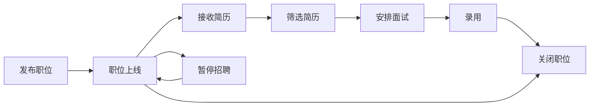

# BOSS 直聘企业端 - 项目文档

## 📋 目录

- [项目概述](#项目概述)
- [技术架构](#技术架构)
- [页面功能详解](#页面功能详解)
- [产品需求文档 (PRD)](#产品需求文档-prd)

---

## 项目概述

### 项目名称
BOSS 直聘企业端招聘管理系统（boss-company-ui）

### 项目定位
面向企业 HR 和招聘人员的一站式招聘管理平台，提供从职位发布、简历筛选、在线沟通到面试安排的全流程招聘服务。

### 核心价值
- **高效招聘**: 智能人岗匹配，快速筛选合适候选人
- **便捷沟通**: 实时在线聊天，支持电话/视频面试
- **数据驱动**: 多维度数据分析，优化招聘效果
- **全流程管理**: 覆盖招聘全生命周期的完整解决方案

### 目标用户
- 企业 HR 经理/专员
- 招聘团队负责人
- 业务部门面试官

---

## 技术架构

### 核心技术栈
```json
{
  "前端框架": "Vue 3.5.22",
  "构建工具": "Vite 4.5.14",
  "UI 组件库": "Element Plus 2.10.2",
  "路由管理": "Vue Router 4.6.3",
  "状态管理": "Pinia 2.3.0",
  "HTTP 请求": "Axios 1.10.0",
  "图标库": "@element-plus/icons-vue"
}
```

### 项目结构
```
boss-company-ui/
├── public/                     # 静态资源
├── src/
│   ├── assets/                 # 项目资源文件
│   ├── components/             # 公共组件
│   ├── layouts/                # 布局组件
│   │   └── CompanyLayout.vue   # 企业端主布局
│   ├── pages/                  # 页面组件
│   │   ├── account/            # 账号设置页
│   │   ├── candidates/         # 简历管理页
│   │   ├── communications/     # 沟通聊天页
│   │   ├── company/            # 公司主页
│   │   ├── dashboard/          # 首页概览
│   │   ├── data/               # 数据看板
│   │   ├── positions/          # 职位管理
│   │   ├── reviews/            # 评价管理
│   │   ├── team/               # 团队管理
│   │   └── Login.vue           # 登录页
│   ├── router/                 # 路由配置
│   │   └── index.js
│   ├── stores/                 # Pinia 状态管理
│   │   └── user.js
│   ├── utils/                  # 工具函数
│   │   └── request.js          # Axios 封装
│   ├── App.vue                 # 根组件
│   ├── main.js                 # 入口文件
│   └── style.css               # 全局样式
├── .env.development            # 开发环境配置
├── .env.production             # 生产环境配置
├── vite.config.js              # Vite 配置文件
├── package.json                # 项目依赖
└── README.md                   # 项目说明
```

### 环境配置

#### 开发环境 (.env.development)
```bash
VITE_API_BASE_URL=/api
VITE_APP_TITLE=Boss 企业端 - 开发环境
```

#### 生产环境 (.env.production)
```bash
VITE_API_BASE_URL=https://api.example.com
VITE_API_BASE_URL=Boss 企业端
```

### 代理配置 (vite.config.js)
```javascript
server: {
  port: 3001,
  proxy: {
    '/api': {
      target: 'http://localhost:8080',
      changeOrigin: true,
    }
  }
}
```

---

## 页面功能详解

### 1. 登录页 (`/login`)

#### 功能描述
企业用户登录入口，支持账号密码登录和记住账号功能。

#### 核心功能
- ✅ 手机号/邮箱登录
- ✅ 密码加密显示
- ✅ 记住账号功能
- ✅ 表单验证（账号 5-50 字符，密码 6 位以上）
- ✅ 登录状态持久化（localStorage）
- ✅ 路由守卫保护
- ⏳ 第三方登录（微信/视频账号）
- ⏳ 忘记密码
- ⏳ 立即注册

#### 界面元素
- Logo 和品牌标识
- 登录表单（账号、密码）
- 记住账号复选框
- 登录按钮
- 其他登录方式入口
- 注册引导链接

#### 技术实现
```javascript
// 登录成功后存储
localStorage.setItem('companyToken', token)
localStorage.setItem('companyUserInfo', userInfo)

// 路由跳转
router.replace('/company/dashboard')
```

---

### 2. 招聘管理首页 (`/company/dashboard`)

#### 功能描述
招聘工作台，展示今日概览、职位效果、待办事项和快捷入口。

#### 核心功能模块

##### 2.1 今日概览
- **在招职位**: 显示当前正在招聘的职位数量
- **今日沟通**: 统计当日主动沟通次数
- **新收简历**: 展示新收到的简历数量
- **待面试**: 显示待安排的面试场次

##### 2.2 职位效果数据表格
| 列名 | 说明 |
|------|------|
| 职位名称 | 可点击查看详情 |
| 查看次数 | 职位被查看的总次数 |
| 主动沟通 | HR 主动沟通候选人数 |
| 收到简历 | 收到的简历总数 |
| 状态 | 招聘中/暂停招聘/已关闭 |
| 操作 | 详情、优化按钮 |

##### 2.3 今日待办时间轴
- 面试安排（时间、候选人、类型）
- 待处理简历
- 未读消息提醒

##### 2.4 快捷入口
- 发布职位
- 优化职位
- 筛选简历
- 数据报告

#### 交互逻辑
- 日期范围筛选（近 7 天/近 30 天/全部）
- 点击职位跳转详情页
- 待办事项点击跳转对应页面

---

### 3. 职位管理页 (`/company/positions`)

#### 功能描述
管理和维护企业所有招聘职位，支持发布、编辑、关闭、删除等操作。

#### 核心功能

##### 3.1 职位列表展示
**列表字段**:
- ID
- 职位名称
- 所属部门
- 工作城市
- 薪资范围
- 经验要求
- 学历要求
- 招聘状态
- 查看次数
- 主动沟通数
- 收到简历数
- 发布日期

##### 3.2 筛选条件
- 关键字搜索（职位名称）
- 状态筛选（招聘中/暂停/已关闭）
- 城市筛选

##### 3.3 操作功能
| 操作 | 说明 | 状态 |
|------|------|------|
| 查看详情 | 跳转职位详情页 | ✅ |
| 编辑职位 | 修改职位信息 | ✅ |
| 立即沟通 | 跳转到聊天页面 | ✅ |
| 查看简历 | 查看投递该职位的简历 | ✅ |
| 暂停/开启 | 切换招聘状态 | ✅ |
| 关闭职位 | 停止招聘 | ✅ |
| 删除职位 | 删除职位（不可恢复） | ✅ |

##### 3.4 分页功能
- 每页条数：10/20/50/100
- 总条数显示
- 页码跳转

#### 业务流程


---

### 4. 简历中心 (`/company/resumes`)

#### 功能描述
管理收到的所有简历，支持多维度筛选、智能匹配度评分和快捷操作。

#### 核心功能

##### 4.1 简历列表
**展示字段**:
- 候选人信息（头像、姓名、年龄、学历、经验）
- 期望职位
- 期望城市
- 期望薪资
- 当前公司
- 投递状态
- 匹配度评分
- 投递时间

##### 4.2 筛选维度
| 维度 | 选项 |
|------|------|
| 关键字 | 姓名/职位/公司 |
| 期望职位 | 前端工程师/产品经理/Java 开发等 |
| 学历 | 大专/本科/硕士/博士 |
| 经验 | 应届生/1-3 年/3-5 年/5 年以上 |
| 状态 | 新投递/已查看/待沟通/已沟通/不合适 |

##### 4.3 智能匹配度
- 算法评分：基于职位要求与简历匹配度
- 可视化展示：进度条 + 百分比
- 颜色区分：
  - 绿色 (≥90%): 高度匹配
  - 橙色 (80-89%): 较为匹配
  - 红色 (<80%): 匹配度低

##### 4.4 快捷操作
| 操作 | 说明 | 状态 |
|------|------|------|
| 查看详情 | 查看完整简历 | ✅ |
| 立即沟通 | 发起在线聊天 | ✅ |
| 下载简历 | 下载 PDF 版本 | ⏳ |
| 批量下载 | 批量导出简历 | ⏳ |
| 人才库 | 添加到企业人才库 | ⏳ |

##### 4.5 状态管理
- **新投递**: 未处理的简历
- **已查看**: HR 已查看但未操作
- **待沟通**: 需要进一步沟通
- **已沟通**: 已与候选人沟通
- **不合适**: 不符合岗位要求

---

### 5. 简历详情页 (`/company/resumes/:id`)

#### 功能描述
展示候选人完整简历信息，支持多种沟通和面试安排。

#### 页面结构

##### 左侧内容区（18 列）

###### 5.1 基本信息卡片
- 头像
- 姓名、年龄、性别
- 学历、工作经验
- 当前城市
- 联系方式（电话、邮箱）
- 岗位匹配度评分

###### 5.2 求职期望
- 期望城市
- 期望职位
- 期望薪资
- 工作状态
- 到岗时间

###### 5.3 教育经历
- 学校名称
- 专业
- 学历
- 就读时间

###### 5.4 工作经历
- 公司名称
- 职位
- 工作时间
- 工作描述

###### 5.5 专业技能
- 技能标签展示

###### 5.6 自我评价
- 个人优势描述

##### 右侧边栏（6 列）

###### 5.7 投递信息
- 投递职位
- 投递时间
- 来源渠道

###### 5.8 快捷操作
- 发起聊天
- 打电话
- 安排面试

#### 顶部操作栏
| 按钮 | 功能 | 状态 |
|------|------|------|
| 立即沟通 | 跳转到聊天窗口 | ✅ |
| 打电话 | 拨打候选人电话 | ⏳ |
| 视频面试 | 发起视频面试 | ⏳ |
| 安排面试 | 预约面试时间 | ⏳ |
| 更多操作 | 标记状态/下载简历 | ✅ |

---

### 6. 消息沟通 (`/company/chat`)

#### 功能描述
与候选人进行实时在线沟通，支持文本消息、图片/附件发送、电话/视频邀请。

#### 页面组成

##### 6.1 聊天列表页（待实现）
- 会话列表
- 未读消息数
- 最近消息预览
- 搜索会话

##### 6.2 聊天窗口页 (`/company/chat/:userId`)

###### 头部信息
- 返回按钮
- 候选人头像和姓名
- 期望职位
- 在线状态（在线/离线）
- 电话/视频按钮

###### 消息区域
- 消息气泡（区分发送/接收）
- 时间戳
- 自动滚动到底部

###### 输入区域
- 富文本工具（附件、图片）
- 文本输入框
- 发送按钮
- 快捷键支持（Enter 发送，Shift+Enter 换行）

#### 消息类型
- ✅ 文本消息
- ⏳ 图片消息
- ⏳ 文件消息
- ⏳ 语音消息
- ⏳ 视频邀请
- ⏳ 面试邀请卡片

#### 技术要点
```javascript
// 消息数据结构
{
  id: 1,
  type: 'sent' | 'received',
  content: '消息内容',
  time: '10:30'
}
```

---

### 7. 公司主页 (`/company/company-profile`)

#### 功能描述
展示和管理企业基本信息，提升企业形象吸引力。

#### 信息模块

##### 7.1 基本信息（只读）
- 公司名称
- 所属行业
- 公司规模
- 公司位置

##### 7.2 公司介绍（可编辑）
- 企业简介
- 发展历程
- 业务领域
- 企业文化

##### 7.3 公司标签
- 五险一金
- 带薪年假
- 弹性工作
- 其他福利

#### 操作流程
1. 编辑公司介绍
2. 添加/修改标签
3. 保存信息
4. 同步到职位详情页

---

### 8. 数据看板 (`/company/data`)

#### 功能描述
多维度数据分析，帮助 HR 了解招聘效果，优化招聘策略。

#### 核心指标卡片

| 指标 | 说明 | 趋势 |
|------|------|------|
| 职位曝光量 | 职位被查看的总次数 | 环比增长 |
| 主动沟通数 | HR 主动沟通候选人数 | 环比增长 |
| 收到简历数 | 收到的简历总数 | 环比增长 |
| 安排面试数 | 已安排的面试场次 | 环比增长 |

#### 数据趋势图（待接入 ECharts）
- X 轴：日期（近 7 天/近 30 天）
- Y 轴：数值
- 多条折线展示：曝光量、沟通数、简历数

#### 职位效果排行榜
| 排名 | 职位名称 | 查看次数 | 收到简历 | 转化率 |
|------|----------|----------|----------|--------|
| 1 | 高级前端工程师 | 1256 | 34 | 2.7% |
| 2 | 产品经理 | 982 | 28 | 2.8% |
| 3 | Java 开发工程师 | 856 | 19 | 2.2% |

#### 转化率计算
```
转化率 = 收到简历数 / 查看次数 × 100%
```

---

### 9. 团队管理 (`/company/team`)

#### 功能描述
管理企业招聘团队成员，分配权限和角色。

#### 功能规划（待实现）
- 团队成员列表
- 成员角色管理（管理员/HR/面试官）
- 权限配置
- 邀请新成员
- 成员数据统计

---

### 10. 账号设置 (`/company/account-settings`)

#### 功能描述
管理个人账号信息和偏好设置。

#### 功能规划（待实现）
- 个人信息修改
- 密码管理
- 通知设置
- 账号安全
- 登录设备管理

---

## 产品需求文档 (PRD)

### 一、文档信息

| 项目 | 内容 |
|------|------|
| 产品名称 | BOSS 直聘企业端招聘管理系统 |
| 文档版本 | v1.0 |
| 更新日期 | 2026-04-01 |
| 文档状态 | 研发中 |

---

### 二、产品概述

#### 2.1 产品背景
随着企业招聘需求的不断增长，传统招聘方式效率低下、渠道分散、数据缺失等问题日益突出。为帮助企业 HR 提高招聘效率、降低招聘成本、优化招聘体验，特开发此企业端招聘管理系统。

#### 2.2 产品目标
1. **提高效率**: 一站式管理所有招聘活动，减少重复操作
2. **精准匹配**: 智能算法推荐合适候选人，提高人岗匹配度
3. **便捷沟通**: 实时在线聊天，快速建立联系
4. **数据驱动**: 多维度数据分析，辅助招聘决策

#### 2.3 用户画像

##### 用户画像 1: HR 经理 - 张经理
- **年龄**: 32 岁
- **职业**: 某互联网公司 HR 经理
- **痛点**: 
  - 每天需要处理大量简历，筛选效率低
  - 多个招聘平台切换，管理混乱
  - 无法及时跟踪招聘进度
- **需求**:
  - 集中管理所有职位和简历
  - 快速筛选合适候选人
  - 实时查看招聘数据

##### 用户画像 2: 招聘专员 - 小李
- **年龄**: 25 岁
- **职业**: 某科技公司招聘专员
- **痛点**:
  - 与候选人沟通效率低
  - 面试安排繁琐
  - 缺乏系统化的工作流程
- **需求**:
  - 便捷的沟通工具
  - 智能化的面试安排
  - 清晰的工作指引

---

### 三、功能需求

#### 3.1 功能架构图
```
招聘管理系统
├── 用户认证
│   ├── 登录
│   ├── 注册
│   └── 权限管理
├── 职位管理
│   ├── 发布职位
│   ├── 编辑职位
│   ├── 职位列表
│   └── 职位数据分析
├── 简历管理
│   ├── 简历列表
│   ├── 简历详情
│   ├── 简历筛选
│   └── 人才库
├── 沟通管理
│   ├── 在线聊天
│   ├── 电话邀约
│   └── 视频面试
├── 面试管理
│   ├── 面试安排
│   ├── 面试反馈
│   └── 面试统计
├── 数据看板
│   ├── 核心指标
│   ├── 趋势分析
│   └── 效果排行
└── 系统设置
    ├── 企业信息
    ├── 团队管理
    └── 账号设置
```

#### 3.2 功能优先级

##### P0 - 核心功能（必须实现）
| 编号 | 功能 | 描述 | 优先级 |
|------|------|------|--------|
| F001 | 用户登录 | 账号密码登录、记住登录状态 | P0 |
| F002 | 职位列表 | 展示、筛选、搜索职位 | P0 |
| F003 | 发布职位 | 创建新职位 | P0 |
| F004 | 简历列表 | 展示、筛选简历 | P0 |
| F005 | 简历详情 | 查看完整简历信息 | P0 |
| F006 | 在线聊天 | 与候选人实时沟通 | P0 |
| F007 | 数据概览 | 核心指标展示 | P0 |

##### P1 - 重要功能（应该实现）
| 编号 | 功能 | 描述 | 优先级 |
|------|------|------|--------|
| F101 | 编辑职位 | 修改职位信息 | P1 |
| F102 | 关闭/删除职位 | 管理职位状态 | P1 |
| F103 | 简历状态管理 | 标记简历处理状态 | P1 |
| F104 | 电话邀约 | 一键拨打电话 | P1 |
| F105 | 面试安排 | 预约面试时间 | P1 |
| F106 | 数据趋势图 | 可视化数据展示 | P1 |
| F107 | 公司主页 | 企业信息展示 | P1 |

##### P2 - 增强功能（可以实现）
| 编号 | 功能 | 描述 | 优先级 |
|------|------|------|--------|
| F201 | 视频面试 | 在线视频面试 | P2 |
| F202 | 简历下载 | 导出 PDF 简历 | P2 |
| F203 | 人才库 | 企业人才储备 | P2 |
| F204 | 团队管理 | 成员权限管理 | P2 |
| F205 | 批量操作 | 批量下载/标记 | P2 |
| F206 | 消息通知 | 站内信/邮件/短信 | P2 |

---

### 四、详细功能说明

#### 4.1 登录模块 (F001)

##### 功能描述
用户提供账号密码进行身份验证，登录成功后进入系统。

##### 用户故事
> 作为 HR 用户，我希望通过账号密码登录系统，以便管理我的招聘工作。

##### 需求详述

**输入**:
- 账号：手机号或邮箱（必填）
- 密码：6 位以上（必填）
- 记住账号：勾选框（可选）

**处理逻辑**:
1. 前端验证账号密码格式
2. 调用登录接口
3. 后端验证身份
4. 返回 token 和用户信息
5. 前端存储到 localStorage
6. 跳转到 dashboard

**输出**:
- 成功：跳转首页，显示欢迎消息
- 失败：显示错误提示

##### 验收标准
- [ ] 账号为空时提示"请输入账号"
- [ ] 密码少于 6 位时提示"密码长度不能少于 6 位"
- [ ] 登录成功后正确存储 token
- [ ] 刷新页面保持登录状态
- [ ] 未登录访问受保护路由时跳转登录页

##### 异常处理
- 网络错误：提示"网络错误，请稍后重试"
- 账号不存在：提示"账号或密码错误"
- 密码错误：提示"账号或密码错误"
- 账号被封禁：提示"账号已被封禁，请联系客服"

---

#### 4.2 职位列表模块 (F002)

##### 功能描述
展示企业所有招聘职位，支持搜索、筛选和操作。

##### 用户故事
> 作为 HR，我希望快速找到要管理的职位，以便进行日常维护。

##### 需求详述

**展示内容**:
- 职位基本信息（名称、部门、城市、薪资等）
- 职位效果数据（查看、沟通、简历数）
- 职位状态标识

**筛选条件**:
- 关键字：模糊匹配职位名称
- 状态：招聘中/暂停/已关闭
- 城市：按工作地点筛选

**操作项**:
- 查看详情
- 编辑职位
- 立即沟通
- 查看简历
- 暂停/开启
- 关闭职位
- 删除职位

**分页**:
- 默认每页 10 条
- 支持 10/20/50/100 切换
- 显示总条数

##### 验收标准
- [ ] 列表正确显示所有字段
- [ ] 搜索功能正常
- [ ] 筛选条件生效
- [ ] 分页功能正常
- [ ] 各操作按钮响应正确

---

#### 4.3 发布职位模块 (F003)

##### 功能描述
创建新的招聘职位，填写完整职位信息。

##### 用户故事
> 作为 HR，我希望快速发布新职位，以便开始招聘。

##### 需求详述

**职位信息**:
1. **基本信息**
   - 职位名称（必填）
   - 所属部门（必填）
   - 职位类别（必填）
   - 工作性质（全职/兼职/实习）

2. **任职要求**
   - 学历（必填）
   - 经验（必填）
   - 年龄范围
   - 性别要求（可选）

3. **薪资福利**
   - 薪资范围（必填）
   - 薪资结构（如 14 薪）
   - 福利待遇（多选标签）

4. **工作地点**
   - 城市（必填）
   - 详细地址（必填）

5. **职位描述**
   - 岗位职责（必填）
   - 任职要求（必填）
   - 加分项（可选）

**操作流程**:
1. 点击"发布职位"按钮
2. 填写职位信息表单
3. 预览职位信息
4. 提交发布
5. 审核通过后上线

##### 验收标准
- [ ] 必填项验证正常
- [ ] 表单格式正确
- [ ] 提交成功提示
- [ ] 职位出现在列表中

---

#### 4.4 简历列表模块 (F004)

##### 功能描述
展示所有收到的简历，支持多维度筛选和智能匹配。

##### 用户故事
> 作为 HR，我希望快速筛选出合适的候选人，以便提高招聘效率。

##### 需求详述

**列表展示**:
- 候选人基本信息
- 期望职位和薪资
- 当前公司信息
- 投递状态
- 智能匹配度

**筛选维度**:
- 关键字（姓名/职位/公司）
- 期望职位
- 学历
- 工作经验
- 投递状态
- 投递时间范围

**智能匹配**:
- 基于职位要求自动评分
- 百分制显示
- 颜色区分匹配度等级

**快捷操作**:
- 查看简历详情
- 立即沟通
- 下载简历
- 标记状态

##### 验收标准
- [ ] 简历信息完整显示
- [ ] 多条件组合筛选生效
- [ ] 匹配度评分准确
- [ ] 快捷操作响应正确

---

#### 4.5 在线聊天模块 (F006)

##### 功能描述
HR 与候选人实时在线沟通的工具。

##### 用户故事
> 作为 HR，我希望与候选人即时沟通，以便快速了解对方情况。

##### 需求详述

**功能特性**:
1. **消息收发**
   - 文本消息
   - 表情符号
   - 图片/文件（待实现）
   - 消息已读未读状态

2. **会话管理**
   - 会话列表
   - 未读消息数
   - 消息时间排序
   - 搜索会话

3. **沟通工具**
   - 拨打电话
   - 视频邀请
   - 面试邀请卡片
   - 发送职位链接

4. **用户体验**
   - Enter 发送消息
   - Shift+Enter 换行
   - 消息自动滚动
   - 离线消息保存

##### 验收标准
- [ ] 消息发送接收正常
- [ ] 消息记录保存完整
- [ ] 未读消息提醒准确
- [ ] 快捷工具响应正确

---

### 五、非功能性需求

#### 5.1 性能需求
- 页面加载时间 < 2 秒
- 接口响应时间 < 500ms
- 列表渲染支持 1000+ 数据不卡顿
- 图片懒加载

#### 5.2 安全需求
- HTTPS 传输
- Token 身份验证
- XSS 防护
- CSRF 防护
- 敏感信息加密存储

#### 5.3 可用性需求
- 系统可用性 ≥ 99.9%
- 支持并发用户数 ≥ 10000
- 故障恢复时间 < 30 分钟

#### 5.4 兼容性需求
- Chrome >= 90
- Firefox >= 88
- Safari >= 14
- Edge >= 90
- 移动端适配（后续）

---

### 六、数据埋点需求

#### 6.1 关键事件埋点

| 事件名称 | 触发时机 | 上报数据 |
|----------|----------|----------|
| login_success | 登录成功 | 用户 ID、登录时间 |
| position_publish | 发布职位 | 职位 ID、发布时间 |
| resume_view | 查看简历 | 简历 ID、停留时长 |
| chat_send | 发送消息 | 消息类型、接收方 ID |
| interview_arrange | 安排面试 | 面试 ID、职位 ID |

#### 6.2 数据统计指标
- 日活跃用户数 (DAU)
- 月活跃用户数 (MAU)
- 人均发布职位数
- 人均沟通数
- 简历处理率
- 面试到场率

---

### 七、迭代计划

#### 第一阶段：MVP（最小可行产品）- 已完成
**周期**: 2 周  
**目标**: 完成核心功能开发

**交付内容**:
- ✅ 用户登录
- ✅ 职位管理（列表、详情、发布）
- ✅ 简历管理（列表、详情）
- ✅ 在线聊天
- ✅ 数据概览

#### 第二阶段：功能完善 - 进行中
**周期**: 3 周  
**目标**: 完善现有功能，提升用户体验

**计划内容**:
- ⏳ 电话/视频面试
- ⏳ 简历下载
- ⏳ 面试安排
- ⏳ 数据图表（ECharts）
- ⏳ 消息通知

#### 第三阶段：增值功能
**周期**: 3 周  
**目标**: 增加差异化功能

**计划内容**:
- 人才库管理
- 团队管理
- 批量操作
- 数据报表导出
- 移动端适配

#### 第四阶段：智能化升级
**周期**: 4 周  
**目标**: AI 赋能招聘

**计划内容**:
- AI 简历解析
- 智能人岗匹配优化
- 聊天机器人助手
- 面试面评自动生成

---

### 八、风险与应对

#### 风险 1: 后端接口延期
**影响**: 前端无法联调，功能验证受阻  
**应对措施**:
- 使用 Mock 数据先行开发
- 制定详细的接口文档
- 定期沟通对齐进度

#### 风险 2: 性能问题
**影响**: 大量数据渲染卡顿  
**应对措施**:
- 虚拟列表优化长列表
- 分页加载
- 图片懒加载
- 防抖节流优化

#### 风险 3: 兼容性问题
**影响**: 部分浏览器显示异常  
**应对措施**:
- 使用主流 CSS 特性
- 多浏览器测试
- Polyfill 补充

---

### 九、附录

#### 9.1 术语表
| 术语 | 解释 |
|------|------|
| HR | Human Resources，人力资源 |
| Token | 身份验证令牌 |
| API | Application Programming Interface |
| DAU | Daily Active Users，日活跃用户 |
| MAU | Monthly Active Users，月活跃用户 |

#### 9.2 参考资料
- [Vue 3 官方文档](https://vuejs.org/)
- [Element Plus 文档](https://element-plus.org/)
- [Vite 文档](https://vitejs.dev/)
- [Pinia 文档](https://pinia.vuejs.org/)

---

## 更新日志

| 版本 | 日期 | 更新内容 | 作者 |
|------|------|----------|------|
| v1.0 | 2026-04-01 | 初始版本，完成项目概述和功能 PRD | AI Assistant |

---

**文档结束**
