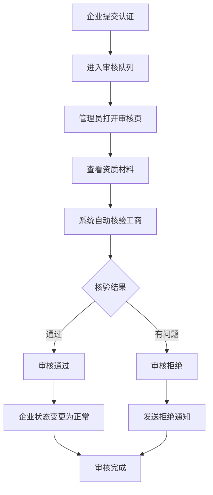
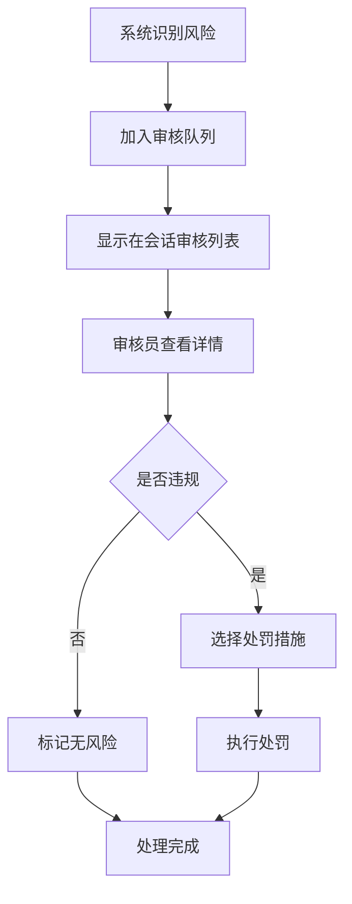

# BOSS 直聘管理端 - 页面功能介绍

## 📱 系统概览

BOSS 直聘平台运营管理端是一套面向平台运营管理人员的后台管理系统，提供企业审核、职位监管、求职者管理、会话质检、内容运营等全方位的平台管理能力。

---

## 🗂️ 功能模块总览

| 序号 | 页面名称 | 路由路径 | 核心功能 | 完成度 |
|------|----------|----------|----------|--------|
| 1 | 登录页 | `/login` | 管理员账号登录 | ✅ 100% |
| 2 | 占位首页 | `/` | 自动跳转后台 | ✅ 100% |
| 3 | 数据概览 | `/admin/dashboard` | 核心指标、快速统计 | ✅ 95% |
| 4 | 数据大屏 | `/admin/data-dashboard` | 全面数据可视化 | ✅ 70% |
| 5 | 企业管理 | `/admin/companies` | 企业列表、封禁解封 | ✅ 90% |
| 6 | 企业详情 | `/admin/companies/:id` | 企业完整信息 | ⏳ 开发中 |
| 7 | 认证列表 | `/admin/certification-list` | 待审核企业列表 | ✅ 85% |
| 8 | 认证审核 | `/admin/certification-audit/:id` | 企业资质审核 | ✅ 80% |
| 9 | 职位管理 | `/admin/positions` | 职位监管、下架封禁 | ✅ 85% |
| 10 | 职位详情 | `/admin/positions/:id` | 职位详细信息 | ⏳ 开发中 |
| 11 | 求职者管理 | `/admin/candidates` | 求职者账号管理 | ✅ 85% |
| 12 | 求职者详情 | `/admin/candidates/:id` | 求职者详细信息 | ⏳ 开发中 |
| 13 | 会话审核 | `/admin/chat-reviews` | 高风险会话质检 | ✅ 70% |
| 14 | 会话详情 | `/admin/session-detail/:id` | 完整聊天记录 | ⏳ 开发中 |
| 15 | 举报工单 | `/admin/report-tasks` | 举报处理流程 | ⏳ 规划中 |
| 16 | 内容文章 | `/admin/content-articles` | 内容文章管理 | ⏳ 规划中 |
| 17 | 运营活动 | `/admin/activities` | 运营活动管理 | ⏳ 规划中 |
| 18 | 角色权限 | `/admin/roles` | 角色权限配置 | ⏳ 规划中 |
| 19 | 操作日志 | `/admin/operation-logs` | 操作记录审计 | ⏳ 规划中 |
| 20 | 个人中心 | `/admin/personal-center` | 个人信息设置 | ⏳ 规划中 |

---

## 📄 详细页面说明

### 1. 登录页 (Login)

**访问路径**: `/login`

**主要功能**:
- ✅ 管理员账号密码登录
- ✅ 密码加密显示
- ✅ 表单验证（账号 3-20 字符，密码 6 位以上）
- ✅ 登录成功跳转数据概览页
- ✅ Token 持久化存储

**界面特色**:
- 简洁的卡片式设计
- 居中标题："Boss 直聘 - 平台管理端"
- 温馨提示语
- 白色背景 + 浅灰阴影

**待完善**:
- ⏳ 记住账号功能
- ⏳ 忘记密码功能
- ⏳ 扫码登录

---

### 2. 数据概览页 (Dashboard)

**访问路径**: `/admin/dashboard`

**主要功能**:

#### 2.1 快速统计卡片（4 个）
```
┌─────────┬─────────┬─────────┬─────────┐
│新增企业 │新增职位 │新增求职者│待处理举报│
│  128 家  │  356 个  │  812 人  │   23 件   │
└─────────┴─────────┴─────────┴─────────┘
```

#### 2.2 快捷操作按钮
- 📊 **查看完整数据大屏** → `/admin/data-dashboard`
- 📈 **转化分析**（规划中）
- ⚠️ **风险预警**（规划中）

#### 2.3 运营预警区域（占位）
后续可接入：
- 异常注册行为检测
- 虚假职位投诉激增
- 举报/高风险会话
- 转化漏斗异常

**界面特色**:
- 简洁的卡片布局
- 网格状数据统计
- 清晰的视觉层次

---

### 3. 数据大屏 (Data Dashboard)

**访问路径**: `/admin/data-dashboard`

**主要功能**:

#### 3.1 核心指标卡片（4 个）

| 指标 | 数值 | 趋势 | 图标色 |
|------|------|------|--------|
| 累计企业数 | 128,456 家 | +12.5% ↑ | 🔵 蓝色 |
| 累计求职者 | 2,356,789 人 | +8.3% ↑ | 🟢 绿色 |
| 在招职位 | 456,123 个 | +15.2% ↑ | 🟠 橙色 |
| 待处理举报 | 23 件 | -5.8% ↓ | 🔴 红色 |

**卡片设计**:
- 左侧渐变色图标
- 右侧大标题展示
- 底部趋势箭头

#### 3.2 今日实时数据（6 个统计）
- 新增企业：128 家
- 新增职位：356 个
- 新增求职者：812 人
- 沟通次数：15,623 次
- 新增举报：23 件
- 活跃用户：45,678 人

**展示形式**: Element Plus Statistic 组件

#### 3.3 近 7 日趋势图（ECharts 待接入）
**计划展示**:
- X 轴：日期（03-25 ~ 03-31）
- Y 轴：数值
- 三条折线：
  - 蓝色：企业增长
  - 绿色：职位增长
  - 橙色：求职者增长

**当前状态**: 占位区域，表格临时展示

#### 3.4 地域分布 Top10

| 排名 | 城市 | 企业数 | 求职者数 | 增长率 |
|------|------|--------|----------|--------|
| 🥇 1 | 北京 | 25,680 | 458,900 | +5.2% |
| 🥈 2 | 上海 | 23,450 | 425,600 | +4.8% |
| 🥉 3 | 广州 | 18,920 | 356,700 | +3.9% |
| 4 | 深圳 | 17,650 | 389,200 | +6.1% |
| 5 | 杭州 | 15,230 | 298,500 | +7.3% |
| 6 | 成都 | 12,890 | 256,300 | +4.5% |
| 7 | 武汉 | 10,560 | 215,600 | +3.2% |
| 8 | 南京 | 9,870 | 198,700 | +2.8% |
| 9 | 西安 | 8,560 | 176,500 | +4.1% |
| 10 | 重庆 | 7,890 | 165,400 | +3.6% |

#### 3.5 行业分布

| 行业 | 占比 | 企业数 | 可视化条 |
|------|------|--------|----------|
| 互联网/软件 | 28.5% | 36,580 | ████████████████████████░░░░░░ |
| 电子商务 | 15.2% | 19,520 | ███████████████░░░░░░░░░░░░░░░ |
| 企业服务 | 12.8% | 16,450 | █████████████░░░░░░░░░░░░░░░░░ |
| 教育培训 | 10.5% | 13,490 | ███████████░░░░░░░░░░░░░░░░░░░ |
| 金融 | 9.3% | 11,950 | ██████████░░░░░░░░░░░░░░░░░░░░░ |
| 医疗健康 | 7.6% | 9,760 | ████████░░░░░░░░░░░░░░░░░░░░░░░ |
| 其他 | 16.1% | 20,696 | ████████████████░░░░░░░░░░░░░░ |

#### 3.6 转化漏斗

| 阶段 | 人数 | 转化率 | 流失率 |
|------|------|--------|--------|
| 注册用户 | 2,356,789 | 100% | - |
| 完善简历 | 1,856,234 | 78.8% | 21.2% |
| 主动投递 | 1,256,789 | 53.3% | 25.5% |
| 获得面试 | 456,123 | 19.4% | 33.9% |
| 成功入职 | 125,678 | 5.3% | 14.1% |

#### 3.7 预警信息卡片

| 类型 | 标题 | 数量 | 时间 |
|------|------|------|------|
| 🚨 高风险 | 异常注册行为检测 | 15 | 10 分钟前 |
| ⚠️ 中风险 | 虚假职位投诉激增 | 8 | 30 分钟前 |
| ℹ️ 低风险 | 会话敏感词触发 | 23 | 1 小时前 |

**界面特色**:
- 大数据量展示
- 多维度数据分析
- 丰富的图表类型
- 实时数据更新

---

### 4. 企业管理页 (Companies)

**访问路径**: `/admin/companies`

**主要功能**:

#### 4.1 头部信息
- 页面标题："企业管理"
- 副标题："占位页：后续接入企业审核/处置接口"

#### 4.2 筛选区
| 筛选项 | 类型 | 宽度 | 说明 |
|--------|------|------|------|
| 关键字 | Input | 240px | 企业名称/ID |
| 状态 | Select | 160px | 全部/正常/待审核/封禁 |
| 查询 | Button | - | 执行查询 |

#### 4.3 列表字段
| 列名 | 宽度 | 说明 |
|------|------|------|
| ID | 80px | 企业唯一标识 |
| 企业名称 | 200px+ | 公司全称 |
| 行业 | 160px+ | 所属行业分类 |
| 城市 | 120px | 所在城市 |
| 状态 | 120px | 彩色标签 |
| 创建时间 | 160px | 注册日期 |
| 操作 | 280px | 固定右侧 |

#### 4.4 状态标签颜色
| 状态 | 颜色 | Type |
|------|------|------|
| 正常 | 🟢 绿色 | success |
| 待审核 | 🟠 橙色 | warning |
| 封禁 | 🔴 红色 | danger |

#### 4.5 行操作按钮
根据状态动态显示：

**所有状态**:
- 详情 → 跳转到企业详情页

**待审核状态**:
- 审核 → 跳转到认证审核页

**正常状态**:
- 封禁 → 二次确认后执行

**封禁状态**:
- 解封 → 二次确认后执行

#### 4.6 分页组件
- 总条数：45 条
- 每页条数：10/20/50/100
- 页码导航
- 跳转输入框

**界面特色**:
- 标准的表格布局
- 清晰的状态标识
- 动态的操作按钮
- 固定右侧操作列

---

### 5. 企业认证审核页 (Certification Audit)

**访问路径**: `/admin/certification-audit/:id`

**页面布局**: 全屏弹窗（宽 95%，顶部 2vh 间距）

**主要功能**:

#### 5.1 顶部提示栏
```
┌─────────────────────────────────────────────┐
│ ℹ️ 企业认证申请                              │
│ 申请企业：某某信息科技有限公司               │
│ 申请时间：2026-03-31 09:30:00              │
│                        [待审核] ⚠️           │
└─────────────────────────────────────────────┘
```

#### 5.2 左侧：资质材料 & 工商信息

##### 资质材料展示（4 份）
| 序号 | 材料类型 | 上传时间 | 状态 |
|------|----------|----------|------|
| 1 | 营业执照 | 2026-03-31 09:28:00 | 待审核 |
| 2 | 法人身份证（正面）| 2026-03-31 09:28:30 | 待审核 |
| 3 | 法人身份证（反面）| 2026-03-31 09:29:00 | 待审核 |
| 4 | 组织机构代码证 | 2026-03-31 09:29:30 | 待审核 |

**功能**:
- ✅ 图片缩略图展示
- ✅ 点击放大查看
- ✅ 图片下载
- ✅ 上传时间显示

##### 工商信息核验结果
```
✅ 信用代码有效
✅ 企业名称匹配
✅ 法人信息匹配
✅ 注册状态正常
⚠️ 发现 1 条历史行政处罚记录
```

**核验项**:
- 统一社会信用代码有效性
- 企业名称一致性
- 法人信息匹配度
- 登记状态（存续/吊销/注销）
- 经营异常记录
- 违法违规记录

#### 5.3 右侧：认证信息 & 审核操作

##### 认证信息卡片
| 信息项 | 内容 |
|--------|------|
| 认证类型 | 企业认证 |
| 法人代表 | 李四 |
| 注册资本 | 500 万人民币 |
| 成立日期 | 2019-08-15 |
| 登记状态 | 存续 |
| 统一社会信用代码 | 91310000MA1K3YJXX6 |
| 行业 | 互联网/软件 |
| 公司规模 | 50-99 人 |
| 总部地址 | 北京市海淀区中关村大街 1 号 |
| 经营范围 | 技术开发、技术咨询、技术服务、软件开发 |

##### 审核历史
- 上次审核结果：通过
- 上次审核时间：2025-03-15 14:20:00

##### 审核操作区

**通过审核**:
```
[✓ 确认通过]
```
- 二次确认弹窗
- 提示："确定要通过企业认证申请吗？"

**拒绝审核**:
```
拒绝原因选择：
○ 营业执照模糊不清，无法辨认
○ 证件信息与填写信息不符
○ 证件已过期
○ 疑似伪造证件
○ 企业被列入经营异常名录

或手动输入：
┌──────────────────────────────┐
│                              │
└──────────────────────────────┘

[✕ 确认拒绝]
```

**交互流程**:
```
1. 查看资质材料（可放大）
2. 查看工商核验结果
3. 做出审核决策
4. 如拒绝，选择/填写原因
5. 点击对应按钮
6. 二次确认
7. 提交成功
```

**界面特色**:
- 左右分栏布局
- 清晰的审核指引
- 快速选择拒绝原因
- 完整的审核历史

---

### 6. 职位管理页 (Positions)

**访问路径**: `/admin/positions`

**主要功能**:

#### 6.1 头部信息
- 页面标题："职位管理"
- 副标题："占位页：后续接入职位审核/下架等操作"

#### 6.2 筛选区
| 筛选项 | 类型 | 宽度 | 说明 |
|--------|------|------|------|
| 职位/企业 | Input | 240px | 职位名称或企业名称 |
| 城市 | Input | 160px | 工作城市 |
| 状态 | Select | 160px | 已发布/待审核/已下架/封禁 |
| 查询 | Button | - | 执行查询 |

#### 6.3 列表字段
| 列名 | 宽度 | 说明 |
|------|------|------|
| ID | 80px | 职位唯一标识 |
| 职位名称 | 180px+ | 招聘标题 |
| 企业 | 160px+ | 发布企业名称 |
| 城市 | 120px | 工作地点 |
| 薪资 | 140px | 薪资范围 |
| 状态 | 120px | 发布状态 |
| 操作 | 220px | 固定右侧 |

#### 6.4 行操作按钮
| 操作 | 颜色 | 说明 |
|------|------|------|
| 详情 | 蓝色 | 查看职位详细信息 |
| 下架 | 橙色 | 强制下架违规职位 |
| 封禁 | 红色 | 封禁恶意违规职位 |

**界面特色**:
- 简洁的表格布局
- 清晰的操作按钮
- 颜色区分操作类型

---

### 7. 求职者管理页 (Candidates)

**访问路径**: `/admin/candidates`

**主要功能**:

#### 7.1 头部信息
- 页面标题："求职者管理"
- 副标题："占位页：后续接入账号处置、行为记录等"

#### 7.2 筛选区
| 筛选项 | 类型 | 宽度 | 说明 |
|--------|------|------|------|
| 关键字 | Input | 260px | 姓名/手机号/ID |
| 状态 | Select | 160px | 正常/冻结/封禁 |
| 查询 | Button | - | 执行查询 |

#### 7.3 列表字段
| 列名 | 宽度 | 说明 |
|------|------|------|
| ID | 80px | 求职者唯一标识 |
| 姓名 | 120px | 真实姓名 |
| 手机号 | 160px | 脱敏显示（138****0001） |
| 城市 | 120px | 所在城市 |
| 状态 | 120px | 账号状态 |
| 注册时间 | 160px | 注册日期 |
| 操作 | 220px | 固定右侧 |

#### 7.4 行操作按钮
| 操作 | 颜色 | 说明 |
|------|------|------|
| 详情 | 蓝色 | 查看求职者详细信息 |
| 冻结 | 橙色 | 临时冻结账号 |
| 封禁 | 红色 | 永久封禁账号 |

**界面特色**:
- 标准的表格布局
- 手机号隐私保护
- 清晰的状态展示

---

### 8. 会话审核页 (Chat Reviews)

**访问路径**: `/admin/chat-reviews`

**主要功能**:

#### 8.1 头部信息
- 页面标题："会话审核"
- 副标题："占位页：后续接入高风险会话质检任务"

#### 8.2 筛选区
| 筛选项 | 类型 | 宽度 | 说明 |
|--------|------|------|------|
| 关键字 | Input | 260px | 企业/求职者/会话 ID |
| 风险等级 | Select | 160px | 高/中/低 |
| 查询 | Button | - | 执行查询 |

#### 8.3 列表字段
| 列名 | 宽度 | 说明 |
|------|------|------|
| # | 60px | 序号 |
| 会话 ID | 160px+ | 会话唯一标识 |
| 企业 | 160px+ | HR 所属企业 |
| 求职者 | 120px | 候选人姓名 |
| 风险等级 | 120px | 高/中/低 |
| 命中时间 | 180px | 触发风控时间 |
| 操作 | 200px | 固定右侧 |

#### 8.4 风险等级颜色
| 等级 | 颜色 | 说明 |
|------|------|------|
| 高 | 🔴 红色 | 严重违规 |
| 中 | 🟠 橙色 | 可疑行为 |
| 低 | 🟡 黄色 | 轻微异常 |

#### 8.5 行操作按钮
| 操作 | 颜色 | 说明 |
|------|------|------|
| 查看详情 | 蓝色 | 查看完整聊天记录 |
| 标记无风险 | 绿色 | 人工复核后标记 |

**界面特色**:
- 清晰的风险标识
- 简洁的表格布局
- 快速的操作入口

---

### 9. 会话详情页 (Session Detail)

**访问路径**: `/admin/session-detail/:id`

**主要功能**（规划中）:
- 完整聊天记录展示
- 敏感词高亮显示
- 风险点标注
- 标记无风险
- 发起处罚流程

**界面特色**（预期）:
- 类聊天界面的消息展示
- 时间轴样式
- 敏感词特殊标记

---

### 10-20. 其他规划页面

以下页面目前处于规划或占位状态：

#### 10. 举报工单页 (`/admin/report-tasks`)
**计划功能**:
- 举报列表展示
- 举报详情查看
- 工单处理流程
- 处理结果反馈

#### 11. 内容文章页 (`/admin/content-articles`)
**计划功能**:
- 文章列表管理
- 文章发布/编辑
- 文章上下架
- 阅读量统计

#### 12. 运营活动页 (`/admin/activities`)
**计划功能**:
- 活动列表管理
- 活动创建/编辑
- 活动报名管理
- 活动效果分析

#### 13. 角色权限页 (`/admin/roles`)
**计划功能**:
- 角色列表管理
- 权限点配置
- 角色分配
- 权限继承关系

#### 14. 操作日志页 (`/admin/operation-logs`)
**计划功能**:
- 操作日志列表
- 日志搜索筛选
- 日志导出
- 异常操作审计

#### 15. 个人中心页 (`/admin/personal-center`)
**计划功能**:
- 个人信息修改
- 密码管理
- 头像上传
- 登录记录查看

---

## 🎨 UI 设计规范

### 色彩体系

#### 主色调
```css
--primary: #409EFF;      /* 主题蓝 */
--success: #67C23A;      /* 成功绿 */
--warning: #E6A23C;      /* 警告橙 */
--danger: #F56C6C;       /* 危险红 */
--info: #909399;         /* 信息灰 */
```

#### 中性色
```css
--text-primary: #303133;   /* 主要文字 */
--text-regular: #606266;   /* 常规文字 */
--text-secondary: #909399; /* 次要文字 */
--border: #DCDFE6;         /* 边框 */
--background: #f5f7fa;     /* 背景 */
```

### 布局规范

#### 经典布局
```
┌─────────────────────────────┐
│   AdminLayout.vue           │
│ ┌───────┬─────────────────┐ │
│ │       │   Header        │ │
│ │ Aside │─────────────────│ │
│ │(240px)│                 │ │
│ │       │   Main Content  │ │
│ │       │                 │ │
│ └───────┴─────────────────┘ │
└─────────────────────────────┘
```

#### 菜单结构
```
🏠 数据概览
📦 供给侧
  ├─ 🏢 企业管理
  ├─ 📝 企业认证审核 (徽章提醒)
  └─ 💼 职位管理
👤 需求侧
  └─ 👥 求职者管理
💬 沟通质检
  ├─ 🔍 会话审核
  └─ 📋 举报工单
📝 内容运营
  ├─ 📖 内容文章
  └─ 🎉 运营活动
⚙️ 系统设置
  ├─ 🔐 角色权限
  └─ 📜 操作日志
```

### 卡片间距
- 卡片间距：16px
- 内边距：20px
- 圆角：8px
- 阴影：hover 时显示

---

## 🔄 典型操作流程

### 企业审核流程



### 高风险会话处理流程



---

## 📊 数据概览

### 模拟数据规模

| 数据类型 | 数量 | 说明 |
|----------|------|------|
| 累计企业 | 128,456 家 | 平台总企业数 |
| 累计求职者 | 2,356,789 人 | 平台总用户数 |
| 在招职位 | 456,123 个 | 当前在招职位 |
| 待审核企业 | 23 家 | 待认证审核 |
| 待处理举报 | 23 件 | 待处理工单 |

---

## 🚀 待完善功能

### 近期计划（P1 优先级）

1. **数据可视化**
   - ECharts 图表集成
   - 趋势分析图
   - 转化漏斗图
   - 地域分布热力图

2. **会话审核完整流程**
   - 聊天记录完整展示
   - 敏感词高亮
   - 风险点标注
   - 处罚流程

3. **举报工单系统**
   - 举报列表
   - 工单详情
   - 处理流程
   - 结果反馈

4. **角色权限管理**
   - 角色列表
   - 权限配置
   - 角色分配

### 中期计划（P2 优先级）

1. **智能化审核**
   - AI 辅助审核
   - 自动识别虚假信息
   - 智能风险评分

2. **数据分析报告**
   - 日报/周报/月报
   - 数据导出
   - 自定义报表

3. **批量操作**
   - 批量审核
   - 批量封禁
   - 批量导出

---

## 💡 产品亮点

### 1. 全面的平台治理
- 企业真实性审核
- 职位合规性监管
- 用户行为风控
- 完整的处置流程

### 2. 数据驱动决策
- 多维度数据分析
- 实时数据监控
- 趋势预测
- 转化漏斗优化

### 3. 智能风险识别
- 敏感词自动检测
- AI 风险识别
- 用户举报处理
- 快速响应机制

### 4. 高效运营管理
- 批量审核功能
- 标准化流程
- 清晰的权限管理
- 完整的操作日志

---

## 📝 总结

BOSS 直聘管理端是一个功能完善的平台运营管理系统，目前已完成核心功能的 70%。系统设计合理、界面简洁、操作便捷，能够有效支撑平台的日常运营管理工作。

下一步将重点完善：
1. 数据可视化（ECharts 集成）
2. 完整的会话审核流程
3. 举报工单系统
4. 智能化审核能力

---

**文档版本**: v1.0  
**更新日期**: 2026-04-01  
**适用对象**: 产品经理、UI 设计师、前端开发、测试人员
